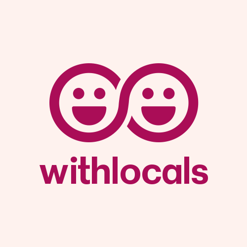

# Capítulo 2: Requirements Eliciation & Analysis
## 2.1. Competidores
- 2.1.1. Análisis competitivo

    **¿Por qué llevar a cabo este análisis?**  
    Este análisis permite entender el entorno competitivo en el que TripMatch operará, identificar las fortalezas y debilidades de plataformas similares a nivel local e internacional, y delinear estrategias efectivas para posicionar a Turisnap como una solución confiable y diferenciada para el turismo personalizado y responsable.

    | **Categoría** | **TripMatch**  | **Withlocals**  | **ToursByLocals**  | **Showaround**  |
    |---------------|------------------|-------------------|----------------------|----------------------|
    | **Overview** | Plataforma digital que conecta turistas con agencias locales para experiencias personalizadas. | Conecta viajeros con anfitriones locales para tours privados. | Tours privados guiados por expertos locales. | Recorridos personalizados con locales en su ciudad. |
    | **Ventaja competitiva** | Filtros por tipo de viaje, presupuesto, duración; reservas instantáneas; soporte a agencias locales. | Experiencias privadas y auténticas en ciudades populares. | Personalización de itinerarios con guías especializados. | Perspectiva local auténtica para conocer la ciudad como residente. |
    | **Mercado objetivo** | Viajeros que buscan autenticidad y agencias que desean digitalizarse. | Viajeros interesados en cultura local y experiencias no masificadas. | Turistas con alto presupuesto que buscan experiencias exclusivas. | Millennials y Gen Z viajeros espontáneos. |
    | **Estrategias de marketing** | Alianzas con blogs de viaje, redes sociales, posicionamiento SEO en turismo peruano. | Marketing de influencers, presencia en redes, contenido en video. | Posicionamiento premium, campañas dirigidas a mercados maduros. | Promoción directa en Instagram y TikTok. |
    | **Productos & Servicios** | Buscador por intereses, chat con agencias, reseñas, pagos online. | Tours guiados 1:1, personalizables. | Itinerarios custom, filtros por estilo de viaje. | Recorridos casuales, flexibles y sociales. |
    | **Precios & Costos** | Comisión por transacción (microtransacciones), acceso freemium para agencias. | Precio por experiencia, sin comisiones intermedias. | Tarifa fija por guía, orientado a turismo premium. | Precios negociados directamente con los locales. |
    | **Canales de distribución** | Web responsive, futura app móvil. | Web y app móvil. | Web y app. | App y sitio móvil social. |
    | **Fortalezas** | Enfoque local, flexibilidad, apoyo a pymes, interfaz intuitiva. | Autenticidad, enfoque humano. | Alta calidad y seguridad en el servicio. | Espontaneidad, enfoque juvenil. |
    | **Debilidades** | Plataforma nueva, sin marca reconocida aún. | Limitado a ciertas ciudades. | Costos altos para el usuario. | Falta de control de calidad. |
    | **Oportunidades** | Crecimiento del turismo interno y de experiencias locales. | Tendencia al turismo responsable. | Viajeros de lujo que buscan experiencias únicas. | Mayor uso de apps sociales de viaje. |
    | **Amenazas** | Alta competencia y presencia de marcas globales. | Escalabilidad limitada por modelo 1:1. | Barrera de acceso por costos. | Riesgos de seguridad para el usuario. |

- 2.1.2. Estrategias y tácticas frente a competidores

    TripMatch debe posicionarse como una alternativa local, accesible, confiable y especializada en conectar a viajeros con agencias peruanas. A continuación, se detallan estrategias para competir frente a las fortalezas de plataformas globales, aprovechar debilidades del mercado y mitigar amenazas.

#### Frente a las fortalezas de los competidores

| **Fortalezas de los competidores** | **Estrategias de TripMatch** |
|-----------------------------------|-------------------------------|
| Withlocals ofrece tours íntimos y personalizados. | Reforzar alianzas con agencias locales para experiencias culturales en zonas menos exploradas. |
| ToursByLocals tiene alta reputación y seguridad. | Incorporar validación de identidad, garantías y sistema de soporte proactivo. |
| Showaround apela al contacto informal entre viajeros y locales. | Crear perfiles verificados para guías y filtros por estilo de viaje para personalización real. |

#### Frente a las debilidades de los competidores

| **Debilidades de los competidores** | **Tácticas de TripMatch** |
|------------------------------------|-------------------------------|
| Withlocals está limitado a ciudades grandes. | Enfocarse en destinos emergentes y rurales dentro del Perú. |
| ToursByLocals tiene precios elevados. | Ofrecer experiencias de calidad a precios accesibles gracias a la eliminación de intermediarios. |
| Showaround carece de control de calidad. | Sistema de reputación, verificación de agencias y reseñas verificadas. |

#### Aprovechamiento de oportunidades del entorno

| **Oportunidades del entorno** | **Estrategias para capitalizarlas** |
|-------------------------------|------------------------------------|
| Creciente interés en el turismo responsable. | Promover experiencias sostenibles y apoyar económicamente a comunidades locales. |
| Mayor uso de herramientas digitales para planificar viajes. | Optimizar UX de TripMatch para dispositivos móviles y ofrecer recomendaciones inteligentes. |

#### Mitigación de amenazas del entorno

| **Amenazas externas** | **Tácticas de mitigación** |
|------------------------|----------------------------|
| Presencia de plataformas consolidadas. | Posicionar TripMatch como una solución peruana con valor local y enfoque en experiencias genuinas. |
| Baja confianza en plataformas nuevas. | Transparencia total en tarifas, reseñas verificadas, y garantías de reserva. |

#### Estrategia general

TripMatch se posicionará como una plataforma peruana de turismo responsable y digitalizado, enfocada en conectar viajeros con experiencias auténticas de forma directa y accesible. Su modelo flexible y su enfoque en la experiencia del usuario permitirá escalar en destinos clave del Perú y luego expandirse regionalmente, diferenciándose de competidores globales por su cercanía, confiabilidad y valor cultural.
## 2.2. Entrevistas
### 2.2.1. Diseño de entrevistas
**Preguntas Generales:**  
+ ¿Cuál es tu nombre y a qué te dedicas actualmente?
+ ¿Cuántos años tienes?

**Preguntas Especificas:**   
  
Segmento 1: Turistas    
1. Cuando estás organizando un viaje, ¿qué tan fácil te resulta encontrar actividades o experiencias que realmente se alineen a tus intereses y presupuesto?
2. ¿Qué problemas sueles encontrar cuando buscas y reservas actividades turísticas online?
3. ¿Alguna vez has querido contratar un tour o actividad local y no supiste cómo contactarte con alguien confiable? ¿Qué hiciste en ese caso?
4. ¿Qué tan dispuesto estás a descubrir actividades nuevas durante tu viaje, que no estaban en tu plan original?
5. ¿Te gustaría poder encontrar experiencias personalizadas en una sola app, según tus intereses y reservar directamente con agencias locales? ¿Por qué?
6. ¿Qué haría que confíes en una app que te conecta con operadores locales directamente?
7. ¿Sientes que las plataformas actuales te dan opciones hechas a medida o más bien paquetes estándar para el turismo masivo? ¿Qué te gustaría que cambie?
   
Segmento 2: Agencias de Turismo  
1. ¿Cómo te das a conocer actualmente ante nuevos clientes?
2. ¿Qué tan fácil o difícil es para ti atraer turistas independientes sin intermediarios?
3. ¿Qué herramientas digitales utilizas actualmente para gestionar reservas o promocionar tus servicios?
4. ¿Has tenido problemas para digitalizar algunos aspectos de tu operación? ¿Cuáles?
5. ¿Qué desafíos enfrentas al competir con grandes agencias o plataformas conocidas?
6. ¿Te interesaría una plataforma que permita mostrar tus tours a turistas según sus intereses específicos y que puedan reservar directamente contigo? ¿Por qué?
7. ¿Qué características serían imprescindibles para ti en una plataforma como TripMatch?
8. ¿Cómo manejas actualmente las consultas y reservas de último minuto? ¿Sientes que necesitas automatizar eso?
9. ¿Qué beneficios esperarías obtener al usar una plataforma que conecte directamente agencias locales con viajeros sin tantos intermediarios?

### 2.2.2. Registro de entrevistas

>Segmento 1: Turistas

| Número de entrevista | Datos del entrevistado                                                                                         | Evidencia de entrevista                                                                                                                                      |
|----------------------|-----------------------------------------------------------------------------------------------------------------|--------------------------------------------------------------------------------------------------------------------------------------------------------------|
| 1                    | Nombres: Fernanda Rojas Edad: 19 años Distrito: La Molina Link: [Entrevista 1: Karla Rojas](https://upcedupe-my.sharepoint.com/:v:/g/personal/u202311258_upc_edu_pe/EacDNvV_oulFoz4vMVU_BT8BSuGGmomw0ULMWN7Nf8dMKg?e=LBQ57A) | .png)                                                                        |
| 2                    | Nombres: Leslie Vanessa  Edad: 22 años Distrito: Pachacutec-Ica Link: [Entrevista 2: Leslie Vanessa](https://upcedupe-my.sharepoint.com/:v:/g/personal/u202219481_upc_edu_pe/ER9uSjjYeUpAlCGDYI6ikEUBMF_SZ3xek6ePFchu92xoNg?e=KnUET1&nav=eyJyZWZlcnJhbEluZm8iOnsicmVmZXJyYWxBcHAiOiJTdHJlYW1XZWJBcHAiLCJyZWZlcnJhbFZpZXciOiJTaGFyZURpYWxvZy1MaW5rIiwicmVmZXJyYWxBcHBQbGF0Zm9ybSI6IldlYiIsInJlZmVycmFsTW9kZSI6InZpZXcifX0%3D) |[Entrevista 2: Evidencia](./img/entrevista-leslie.png)                                                                                                                                                       |
| 3                    | Nombres: NOMBRE Y APELLIDO Edad: 00 años Distrito: DISTRITO Link:                                        | Foto                                                                                                                                                         |

>Segmento 2: Agencias de Turismo

| Número de entrevista | Datos del entrevistado | Evidencia de entrevista |
|----------------------|------------------------|-------------------------|
| 1 | Nombres: Abigail Rodriguez  Edad:  21 años  Distrito: Surco  Agencia de Turismo: Authentic Peru Travel  Link: [Entrevista 1: ]() |  |
| 2 | Nombres: NOMBRE Y APELLIDO  Edad: 00 años  Distrito: DISTRITO  Agencia de Turismo:   Link: | Foto |
| 3 | Nombres: NOMBRE Y APELLIDO  Edad: 00 años  Distrito: DISTRITO  Agencia de Turismo:   Link: | Foto |

### 2.2.3. Análisis de entrevistas
>Segmento 1: Turistas

Hallazgos:
+ Los lugares de reserva no suelen ser lo esperado.
+ 

## 2.3. Needfinding
### 2.3.1. User Personas
>Segmento 1: Turistas

>Segmento 2: Agencias de Turismo

### 2.3.2. User Task Matrix

>Segmento 1: Turistas

|Tarea| Frecuencia| Importancia|
|-----|-----------|-------------|
|Buscar experiencias de viaje alineadas a sus intereses y presupuesto| Often|	High|
|Comparar actividades entre distintas agencias antes de tomar una decisión|	Often|	High|
Leer reseñas de otros viajeros sobre paquetes turísticos|	Often|	High|
Reservar paquetes directamente desde la plataforma|	Occasionally	|High|
Contactar a la agencia para resolver dudas antes de reservar	|Sometimes	|Medium|
Compartir su experiencia dejando una reseña	|Occasionally	|Medium|

>Segmento 2: Agencias de Turismo

|Tarea| Frecuencia| Importancia|
|-----|-----------|-------------|
Publicar nuevos paquetes turísticos y actualizarlos	|Often	|High|
Gestionar reservas en tiempo real |	Often	|High|
Responder dudas y mensajes de potenciales clientes	|Often	|High|
Revisar estadísticas sobre visualización y reservas de sus servicios	|Sometimes|	Medium|
Gestionar promociones y descuentos especiales	|Occasionally	|Medium|
Leer y responder reseñas de usuarios sobre sus servicios	|Occasionally	|Medium|
Explorar tendencias en tipos de experiencias populares	|Rarely	|Medium|

### 2.3.3. User Journey Mapping
>Segmento 1: Turistas

>Segmento 2: Agencias de Turismo

### 2.3.4. Empathy Mapping  
>Segmento 1: Turistas  

>Segmento 2: Agencias de Turismo  

### 2.3.5. As-Is Scenario Mapping  
>Segmento 1: Turistas

>Segmento 2: Agencias de Turismo

## 2.4. Ubiquitous Language  
Este glosario representa los conceptos clave que definen nuestro dominio turístico. Su propósito es establecer un lenguaje común entre todos los miembros del equipo y partes interesadas, eliminando ambigüedades y asegurando que todos hablemos el mismo idioma al momento de diseñar, construir y validar nuestra solución.   

| Término | Definición |
| ------- | ------- |
| Traveler (Viajero) | Persona que utiliza la plataforma para descubrir, filtrar y reservar experiencias turísticas de acuerdo a sus intereses, presupuesto y tiempo disponible. | 
| Tour Experience (Experiencia Turística) | Actividad organizada por una agencia, ofrecida en la plataforma, que puede incluir desde recorridos culturales hasta aventuras al aire libre. | 
| Agency (Agencia) | Empresa turística que publica y gestiona sus experiencias a través de la plataforma, ofreciendo disponibilidad, precios y descripciones. | 
| Direct Booking (Reserva Directa) | Proceso mediante el cual el viajero contrata una experiencia directamente con la agencia, sin pasar por intermediarios externos. | 
| Tourist Profile | Proceso mediante el cual el viajero contrata una experiencia directamente con la agencia, sin pasar por intermediarios externos. | 
| Review (Reseña) | Opinión publicada por un viajero después de realizar una experiencia. Las reseñas ayudan a otros viajeros a tomar decisiones basadas en experiencias reales. | 
| Host Location (Destino Anfitrión) | Lugar donde se lleva a cabo la experiencia turística y que forma parte del entorno local ofrecido por las agencias. | 
| Booking Confirmation (Confirmación de Reserva) | Notificación recibida por el viajero y la agencia después de completar la reserva de una experiencia, que garantiza la disponibilidad y los detalles de la actividad. | 
| Custom Experience (Experiencia Personalizada) | Actividad o paquete turístico diseñado específicamente para un viajero o grupo, basado en preferencias particulares como intereses, tiempo disponible o tipo de viaje. | 
