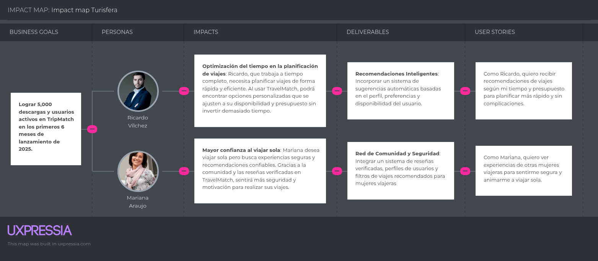

# Capítulo 3: Requirements Specifications
## 3.1. To-Be Scenario Mapping  
>Segmento 1: Turistas

>Segmento 2: Agencias de Turismo

## 3.2. User Stories

|**User story ID**|**Título**|**Descripción** |**Criterio de aceptación**|**Relación (EPIC ID)**|
| :-: | :-: | :-: | :-: | :-: |
|US01|Registro de usuario|**Como** usuario, **quiero** registrarme en la aplicación **para** poder acceder a sus funcionalidades y planificar mis viajes.|
Escenario : Validación de registro de usuario

**Dado que** el sistema verifica que el correo electrónico no esté registrado

**Y** el usuario selecciona "Crear cuenta"

**Cuando** el usuario ingresa todos los campos requeridos y hace clic en "Registrar"

**Entonces** el sistema valida los datos y crea la cuenta del usuario

**Y** muestra un mensaje de éxito en el registro
|EP01|
|US02|Validación de datos de registro|**Como** usuario, **quiero** que el sistema valide mis datos correctamente al registrarme **para** evitar errores.|
Escenario : Validación de campos obligatorios

**Dado que** el usuario intenta registrarse ` `**Y** el sistema detecta campos vacíos o mal ingresados ` `**Cuando** el usuario hace clic en "Registrar" ` `**Entonces** el sistema muestra mensajes de error junto a los campos incorrectos ` `**Y** evita que se complete el registro hasta que todos los campos sean válidos
|EP01|
|US03|Confirmación de contraseña|**Como** usuario, **quiero** confirmar mi contraseña durante el registro **para** asegurarme de que la escribí correctamente.|
Escenario: Comparación de contraseña y confirmación

**Dado que** el usuario ingresa su contraseña en dos campos distintos

**Y** el sistema debe comparar ambas

**Cuando** el usuario hace clic en "Registrar"

**Entonces** el sistema valida que ambas contraseñas coincidan

**Y** muestra un mensaje de error si son diferente
|EP01|
|US04|Mensaje de bienvenida|**Como** usuario, **quiero** recibir un mensaje de bienvenida después de registrarme **para** sentirme valorado.|
Escenario: Registro exitoso con saludo inicial

**Dado que** el usuario ha completado exitosamente el proceso de registro

**Y** el sistema crea su cuenta

**Cuando** se redirige al usuario a la pantalla principal

**Entonces** el sistema muestra un mensaje de bienvenida con su nombre
|EP01|
|US05|Registro con redes sociales|**Como** usuario, **quiero** poder registrarme con mi cuenta de Google o Facebook **para** ahorrar tiempo.|
Escenario: Registro mediante cuenta social

**Dado que** el usuario selecciona "Registrarse con Google/Facebook"

**Y** concede los permisos necesarios

**Cuando** se completa la autenticación externa

**Entonces** el sistema crea una cuenta en Turisfera con los datos recibidos

**Y** redirige al usuario a la pantalla principal
|EP01|
|US06|Confirmación por correo electrónico|**Como** usuario, **quiero** recibir un correo de confirmación después de registrarme **para** validar mi cuenta.|
Escenario: Envío de correo de confirmación

**Dado que** el usuario ha completado el formulario de registro

**Y** ha ingresado un correo electrónico válido

**Cuando** el sistema crea la cuenta

**Entonces** se envía un correo con un enlace de verificación

**Y** el usuario debe hacer clic en el enlace para activar su cuenta
|EP01|
|US07|Búsqueda de destinos turísticos|**Como** usuario, **quiero** buscar destinos turísticos dentro de la aplicación **para** explorar opciones de viaje que se ajusten a mis intereses.|
Escenario: Búsqueda por nombre del destino

**Dado que** el usuario se encuentra en la sección de búsqueda

**Y** desea encontrar un destino específico

**Cuando** el usuario escribe el nombre del destino en la barra de búsqueda

**Entonces** el sistema muestra resultados relacionados con el nombre ingresado

**Y** permite al usuario seleccionar uno para ver más detalles
|EP02|
|US08|Filtros de búsqueda|**Como** usuario, **quiero** usar filtros al buscar destinos **para** encontrar los que se ajusten a mis preferencias.|
Escenario: Aplicación de filtros de búsqueda

**Dado que** el usuario está explorando destinos turísticos

**Y** desea ajustar los resultados

**Cuando** selecciona filtros como tipo de destino, clima o presupuesto

**Entonces** el sistema actualiza los resultados según los filtros seleccionados
|EP02|
|US09|Resultados relevantes de búsqueda|**Como** usuario, **quiero** que los resultados de búsqueda sean relevantes **para** no perder tiempo revisando opciones irrelevantes|
Escenario: Resultados personalizados por preferencia

**Dado que** el usuario ha ingresado un término de búsqueda

**Y** ha configurado previamente sus intereses

**Cuando** se realiza la búsqueda

**Entonces** el sistema ordena los resultados según relevancia y preferencias del usuario
|EP02|
|US10|Vista previa de destinos|**Como** usuario, **quiero** ver una vista previa de cada destino **para** decidir rápidamente cuál me interesa explorar.|
Escenario: Mostrar resumen de destinos en resultados

**Dado que** el usuario visualiza la lista de resultados

**Y** está explorando varias opciones

**Cuando** se muestra cada destino

**Entonces** el sistema incluye nombre, imagen, calificación y breve descripción en la vista previa
|EP02|
|US11|Acceso rápido a destino favorito|**Como** usuario, **quiero** poder marcar destinos como favoritos **para** acceder a ellos rápidamente más adelante.|
Escenario: Agregar destino a favoritos

** ` `**Dado que** el usuario ha encontrado un destino interesante ` `**Y** desea guardarlo ` `**Cuando** hace clic en el ícono de favorito ` `**Entonces** el sistema lo agrega a la lista de favoritos del usuario ` `**Y** permite consultarlo fácilmente desde su perfil

|EP02|
|US12|Búsqueda por región o país|**Como** usuario, **quiero** buscar destinos por país o región **para** explorar zonas específicas que me interesen.|
Escenario: Filtro de región geográfica

**Dado que** el usuario quiere ver destinos dentro de una región específica

**Y** selecciona la región desde un menú desplegable

**Cuando** aplica el filtro

**Entonces** el sistema muestra únicamente los destinos que pertenecen a esa región o país seleccionado
|EP02|
|US13|Eliminar itinerario|**Como** usuario, **quiero** eliminar un itinerario que ya no necesito **para** mantener mi cuenta organizada.|
Escenario: Eliminación de itinerario

** ` `**Dado que** el usuario ha accedido a su lista de itinerarios ` `**Y** desea eliminar uno ` `**Cuando** selecciona "Eliminar" ` `**Entonces** el sistema solicita confirmación ` `**Y** elimina el itinerario seleccionado si el usuario acepta
|EP03|
|US14|Visualizar itinerario completo|
**Como** usuario, **quiero** visualizar todos los detalles de mi itinerario **para** revisarlo antes y durante el viaje.

|
Escenario: Visualización de detalles del itinerario

** ` `**Dado que** el usuario tiene itinerarios guardados ` `**Y** desea consultarlos ` `**Cuando** selecciona un itinerario ` `**Entonces** el sistema muestra toda la información detallada por día, hora y actividad
|EP03|
|US15|Buscar destinos turísticos por nombre|**Como** usuario, **quiero** buscar destinos turísticos por nombre **para** encontrar rápidamente el lugar que deseo visitar.|
Escenario: Búsqueda por nombre de destino

** ` `**Dado que** el usuario está en la sección de búsqueda ` `**Cuando** ingresa el nombre de un destino en el buscador ` `**Entonces** el sistema muestra una lista de coincidencias relacionadas con el término ingresado
|EP04|
|US16|Filtrar destinos por tipo de experiencia|**Como** usuario, **quiero** filtrar los destinos por tipo de experiencia (aventura, relax, cultura, etc.) **para** encontrar opciones que se alineen con mis intereses.|
Escenario: Filtrar destinos

**Dado que** el usuario accede a la búsqueda avanzada

**Cuando** selecciona una o varias categorías de experiencia

**Entonces** el sistema muestra solo aquellos destinos que coincidan con los filtros seleccionados
|EP04|
|US17|Ver detalles de un destino turístico|**Como** usuario, **quiero** ver la información completa de un destino (fotos, descripción, actividades disponibles) **para** decidir si me interesa visitarlo.|
Escenario: Visualización del destino

**Dado que** el usuario ha seleccionado un destino de la lista

**Cuando** hace clic en su nombre o imagen

**Entonces** el sistema muestra una página con todos los detalles del destino y opciones relacionadas
|EP04|
|US18|Guardar destinos favoritos|**Como** usuario, **quiero** guardar destinos como favoritos **para** poder acceder rápidamente a ellos en el futuro.|
Escenario: Agregar a favoritos

**Dado que** el usuario ve un destino interesante

**Cuando** presiona el botón "Guardar como favorito"

**Entonces** el sistema añade ese destino a su lista personal de favoritos y lo confirma con un mensaje
|EP04|
|US19|Ver recomendaciones de destinos según preferencias|**Como** usuario, **quiero** recibir recomendaciones de destinos según mis búsquedas y preferencias **para** descubrir nuevas opciones personalizadas.|
Escenario: Sugerencias personalizadas

**Dado que** el usuario ha interactuado con el sistema (búsquedas, favoritos, filtros)

**Cuando** accede a la sección de recomendaciones

**Entonces** el sistema muestra una lista de destinos sugeridos que se alinean con sus intereses y comportamientos anteriores
|EP04|
|US20|Publicación de paquetes turísticos|**Como** agencia de turismo, **quiero** poder publicar mis paquetes turísticos en la plataforma **para** llegar a más usuarios interesados en viajar.|
**Escenario:** Registro de paquetes turísticos

**Dado que** la agencia tiene una cuenta verificada en TravelMatch

**Cuando** accede a la sección de gestión de paquetes

**Entonces** puede ingresar los detalles del viaje y publicarlos para los usuarios
|EP05|
|US21|Edición de paquetes turísticos publicados|**Como** agencia de turismo, **quiero** editar la información de los paquetes turísticos que ya publiqué **para** mantenerlos actualizados.|
**Escenario:** Actualización de contenido

Dado que la agencia ya tiene paquetes publicados

Cuando necesita cambiar información (fechas, precios, destinos)

Entonces el sistema le permite hacer modificaciones y actualizar los datos
|EP05|
|US22|Visualización de estadísticas de interés|**Como** agencia de turismo, **quiero** ver cuántas personas han mostrado interés en mis paquetes **para** saber cuáles son más atractivos.|
**Escenario:** Acceso a métricas de interés ` `**Dado que** el sistema recopila interacciones de los usuarios ` `**Cuando** la agencia ingresa a su panel de estadísticas ` `**Entonces** se muestran los datos de visitas, clics y favoritos por paquete

|EP05|
|US23|Recepción de solicitudes de contacto|**Como** agencia de turismo, **quiero** recibir notificaciones cuando un usuario quiera más información sobre un paquete **para** poder contactarlo rápidamente.|
**Escenario:** Contacto con usuarios interesados ` `**Dado que** un usuario ha solicitado información ` `**Cuando** la agencia accede a su bandeja de solicitudes ` `**Entonces** puede visualizar los datos del usuario y responderle directamente

|EP05|
|US24|Gestión de disponibilidad de paquetes|**Como** agencia de turismo, **quiero** poder activar o desactivar la disponibilidad de mis paquetes **para** ajustarlos según la temporada o los cupos disponibles.|
**Escenario:** Control de disponibilidad

**Dado que** un paquete puede estar activo o inactivo según disponibilidad

**Cuando** la agencia desee pausarlo o reactivarlo

**Entonces** el sistema le permite modificar su estado fácilmente
|EP05|
|US25|Gestión de reservas de paquetes turísticos|**Como** agencia de turismo, **quiero** gestionar las reservas realizadas por los usuarios **para** tener un control claro de los cupos y atención al cliente.|
**Escenario:** Visualización de reservas

**Dado que** los usuarios realizan reservas a través de la plataforma

**Cuando** la agencia accede a su panel de control

**Entonces** puede ver el listado de reservas con sus detalles (usuario, fecha, paquete)
|EP06|
|US26|Confirmación de reservas|**Como** agencia de turismo, **quiero** confirmar o rechazar reservas pendientes **para** asegurar que se respeten los cupos y condiciones del servicio.|
**Escenario:** Validación de reservas

**Dado que** hay reservas pendientes por confirmar

**Cuando** la agencia revisa los datos de la reserva

**Entonces** puede aprobarla o rechazarla según la disponibilidad
|EP06|
|US27|Comunicación directa con el cliente|**Como** agencia de turismo, **quiero** comunicarme directamente con los usuarios que reservaron **para** brindar información adicional o resolver dudas.|
**Escenario:** Contacto post-reserva

**Dado que** un usuario ha realizado una reserva

**Cuando** la agencia necesite enviar información adicional

**Entonces** puede usar el sistema para enviar un mensaje directo
|EP06|
|US28|Historial de reservas anteriores|**Como** agencia de turismo, **quiero** consultar el historial de reservas anteriores **para** hacer seguimiento y mantener registros de atención.|
**Escenario:** Consulta de historial ` `**Dado que** las reservas se almacenan en la base de datos ` `**Cuando** la agencia accede a su historial ` `**Entonces** puede ver detalles de todas las reservas pasadas organizadas por fecha

|EP06|
|US29|Cancelación de reservas por parte de la agencia|**Como** agencia de turismo, **quiero** cancelar una reserva en casos necesarios **para** gestionar situaciones imprevistas como cambios de itinerario o fuerza mayor.|
**Escenario:** Cancelación de reserva

**Dado que** una reserva ya ha sido realizada

**Cuando** la agencia decide cancelarla

**Entonces** el sistema notifica al usuario y actualiza el estado de la reserva
|EP06|
|US30|Gestión y edición de paquetes turísticos|**Como** agencia de turismo, **quiero** crear y editar paquetes turísticos en la plataforma **para** ofrecer experiencias personalizadas a los usuarios.|
**Escenario:** Creación de paquetes

**Dado que** la agencia desea agregar un nuevo paquete turístico

**Cuando** accede a la sección de administración de paquetes

**Entonces** puede ingresar información como destino, fechas, precios y servicios incluidos
|EP07|
|US31|Actualización de precios y promociones|**Como** agencia de turismo, **quiero** modificar precios y aplicar promociones en mis paquetes **para** atraer más clientes según temporadas.|
**Escenario:** Edición de precios

**Dado que** el paquete ya está publicado en la plataforma

**Cuando** la agencia desea modificar el precio o aplicar un descuento

**Entonces** el sistema actualiza la información y notifica a los usuarios interesados
|EP07|
|US32|Copiar paquetes anteriores para ahorrar tiempo|**Como** agencia de turismo, **quiero** duplicar paquetes turísticos anteriores **para** agilizar la creación de nuevos con información similar.|
**Escenario:** Duplicación de contenido

**Dado que** existen paquetes previos en el historial

**Cuando** la agencia selecciona la opción de duplicar

**Entonces** se crea un nuevo paquete editable con los datos base del anterior
|EP07|
|US33|Inclusión de contenido multimedia en los paquetes|**Como** agencia de turismo, **quiero** agregar imágenes y videos a los paquetes **para** hacerlos más atractivos y detallados para los usuarios.|
**Escenario:** Carga de multimedia

**Dado que** la agencia está editando un paquete

**Cuando** añade fotos o videos al contenido

**Entonces** estos se muestran en la vista previa del paquete para los usuarios
|EP07|

## 3.3. Impact Mapping

El Impact Mapping es una metodología visual y ágil que permite a las organizaciones enfocar el desarrollo de productos y servicios en función de sus metas estratégicas. Esta técnica facilita la identificación de una relación directa entre los objetivos del negocio, las acciones esperadas de los usuarios clave y las soluciones o funcionalidades que deben implementarse para lograr dichos objetivos.

## 3.4. Product Backlog

|# Orden|User Story Id|Description|Story Points (1 /3 /5 /8)|
| :-: | :-: | :-: | :-: |
|1|US01|**Como** usuario, **quiero** registrarme en la aplicación **para** poder acceder a sus funcionalidades y planificar mis viajes.|8|
|2|US02|**Como** usuario, **quiero** que el sistema valide mis datos correctamente al registrarme **para** evitar errores.|5|
|3|US03|**Como** usuario, **quiero** confirmar mi contraseña durante el registro **para** asegurarme de que la escribí correctamente.|3|
|4|US04|**Como** usuario, **quiero** recibir un mensaje de bienvenida después de registrarme **para** sentirme valorado.|8|
|5|US05|**Como** usuario, **quiero** poder registrarme con mi cuenta de Google o Facebook **para** ahorrar tiempo.|8|
|6|US06|**Como** usuario, **quiero** recibir un correo de confirmación después de registrarme **para** validar mi cuenta.|8|
|7|US07|**Como** usuario, **quiero** buscar destinos turísticos dentro de la aplicación **para** explorar opciones de viaje que se ajusten a mis intereses.|5|
|8|US08|**Como** usuario, **quiero** usar filtros al buscar destinos **para** encontrar los que se ajusten a mis preferencias.|5|
|9|US09|**Como** usuario, **quiero** que los resultados de búsqueda sean relevantes **para** no perder tiempo revisando opciones irrelevantes|3|
|10|US10|**Como** usuario, **quiero** ver una vista previa de cada destino **para** decidir rápidamente cuál me interesa explorar.|5|
|11|US11|**Como** usuario, **quiero** poder marcar destinos como favoritos **para** acceder a ellos rápidamente más adelante.|8|
|12|US12|**Como** usuario, **quiero** buscar destinos por país o región **para** explorar zonas específicas que me interesen.|8|
|13|US13|**Como** usuario, **quiero** eliminar un itinerario que ya no necesito **para** mantener mi cuenta organizada.|5|
|14|US14|
**Como** usuario, **quiero** visualizar todos los detalles de mi itinerario **para** revisarlo antes y durante el viaje.

|5|
|15|US15|**Como** usuario, **quiero** buscar destinos turísticos por nombre **para** encontrar rápidamente el lugar que deseo visitar.|3|
|16|US16|**Como** usuario, **quiero** filtrar los destinos por tipo de experiencia (aventura, relax, cultura, etc.) **para** encontrar opciones que se alineen con mis intereses.|5|
|17|US17|**Como** usuario, **quiero** ver la información completa de un destino (fotos, descripción, actividades disponibles) **para** decidir si me interesa visitarlo.|5|
|18|US18|**Como** usuario, **quiero** guardar destinos como favoritos **para** poder acceder rápidamente a ellos en el futuro.|8|
|19|US19|**Como** usuario, **quiero** recibir recomendaciones de destinos según mis búsquedas y preferencias **para** descubrir nuevas opciones personalizadas.|3|
|20|US20|**Como** agencia de turismo, **quiero** poder publicar mis paquetes turísticos en la plataforma **para** llegar a más usuarios interesados en viajar.|3|
|21|US21|**Como** agencia de turismo, **quiero** editar la información de los paquetes turísticos que ya publiqué **para** mantenerlos actualizados.|3|
|22|US22|**Como** agencia de turismo, **quiero** ver cuántas personas han mostrado interés en mis paquetes **para** saber cuáles son más atractivos.|5|
|23|US23|**Como** agencia de turismo, **quiero** recibir notificaciones cuando un usuario quiera más información sobre un paquete **para** poder contactarlo rápidamente.|5|
|24|US24|**Como** agencia de turismo, **quiero** poder activar o desactivar la disponibilidad de mis paquetes **para** ajustarlos según la temporada o los cupos disponibles.|5|
|25|US25|**Como** agencia de turismo, **quiero** gestionar las reservas realizadas por los usuarios **para** tener un control claro de los cupos y atención al cliente.|5|
|26|US26|**Como** agencia de turismo, **quiero** confirmar o rechazar reservas pendientes **para** asegurar que se respeten los cupos y condiciones del servicio.|5|
|27|US27|**Como** agencia de turismo, **quiero** comunicarme directamente con los usuarios que reservaron **para** brindar información adicional o resolver dudas.|3|
|28|US28|**Como** agencia de turismo, **quiero** consultar el historial de reservas anteriores **para** hacer seguimiento y mantener registros de atención.|3|
|29|US29|**Como** agencia de turismo, **quiero** cancelar una reserva en casos necesarios **para** gestionar situaciones imprevistas como cambios de itinerario o fuerza mayor.|1|
|30|US30|**Como** agencia de turismo, **quiero** crear y editar paquetes turísticos en la plataforma **para** ofrecer experiencias personalizadas a los usuarios.|3|
|31|US31|**Como** agencia de turismo, **quiero** modificar precios y aplicar promociones en mis paquetes **para** atraer más clientes según temporadas.|8|
|32|US32|**Como** agencia de turismo, **quiero** duplicar paquetes turísticos anteriores **para** agilizar la creación de nuevos con información similar.|5|
|33|US33|**Como** agencia de turismo, **quiero** agregar imágenes y videos a los paquetes **para** hacerlos más atractivos y detallados para los usuarios.|5|