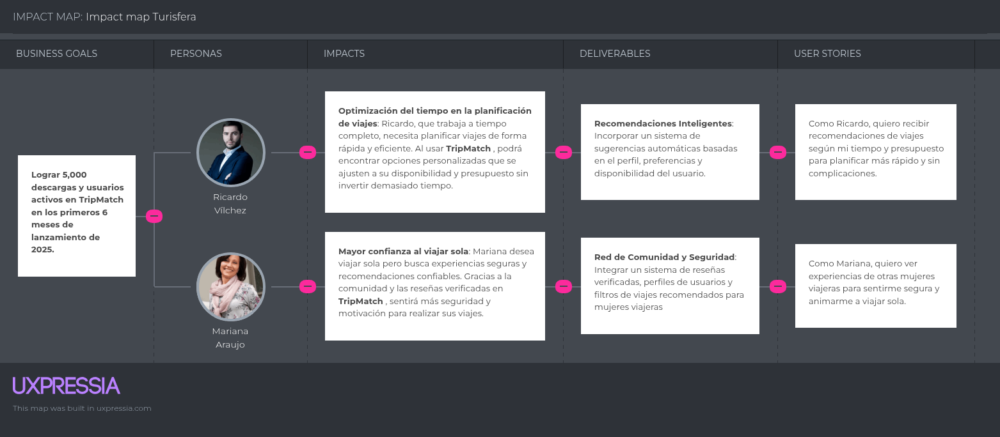

# Capítulo 3: Requirements Specifications
## 3.1. To-Be Scenario Mapping  
>Segmento 1: Turistas

>Segmento 2: Agencias de Turismo

## 3.2. User Stories

|Épica : 01||||
| :- | :- | :- | :- |
|ID - HU|01|Owner|Turisfera|
|Título HU|Registro de usuario|||
|Descripción HU: **Como** usuario, **quiero** registrarme en la aplicación **para** poder acceder a sus funcionalidades y planificar mis viajes.||||
|
Escenario : Validación de registro de usuario

**Dado que** el sistema verifica que el correo electrónico no esté registrado

**Y** el usuario selecciona "Crear cuenta"

**Cuando** el usuario ingresa todos los campos requeridos y hace clic en "Registrar"

**Entonces** el sistema valida los datos y crea la cuenta del usuario

**Y** muestra un mensaje de éxito en el registro
||||

|Épica : 01||||
| :- | :- | :- | :- |
|ID - HU|02|Owner|Turisfera|
|Título HU|Validación de datos de registro|||
|Descripción HU: **Como** usuario, **quiero** que el sistema valide mis datos correctamente al registrarme **para** evitar errores.||||
|
Escenario : Validación de campos obligatorios

**Dado que** el usuario intenta registrarse ` `**Y** el sistema detecta campos vacíos o mal ingresados ` `**Cuando** el usuario hace clic en "Registrar" ` `**Entonces** el sistema muestra mensajes de error junto a los campos incorrectos ` `**Y** evita que se complete el registro hasta que todos los campos sean válidos

||||

|Épica : 01||||
| :- | :- | :- | :- |
|ID - HU|03|Owner|Turisfera|
|Título HU|Confirmación de contraseña|||
|Descripción HU: **Como** usuario, **quiero** confirmar mi contraseña durante el registro **para** asegurarme de que la escribí correctamente.||||
|
Escenario: Comparación de contraseña y confirmación

**Dado que** el usuario ingresa su contraseña en dos campos distintos

**Y** el sistema debe comparar ambas

**Cuando** el usuario hace clic en "Registrar"

**Entonces** el sistema valida que ambas contraseñas coincidan

**Y** muestra un mensaje de error si son diferente
||||

|Épica : 01||||
| :- | :- | :- | :- |
|ID - HU|04|Owner|Turisfera|
|Título HU|Mensaje de bienvenida|||
|Descripción HU: **Como** usuario, **quiero** recibir un mensaje de bienvenida después de registrarme **para** sentirme valorado.||||
|
Escenario: Registro exitoso con saludo inicial

**Dado que** el usuario ha completado exitosamente el proceso de registro

**Y** el sistema crea su cuenta

**Cuando** se redirige al usuario a la pantalla principal

**Entonces** el sistema muestra un mensaje de bienvenida con su nombre
||||

|Épica : 01||||
| :- | :- | :- | :- |
|ID - HU|05|Owner|Turisfera|
|Título HU|Registro con redes sociales|||
|Descripción HU: **Como** usuario, **quiero** poder registrarme con mi cuenta de Google o Facebook **para** ahorrar tiempo.||||
|
Escenario: Registro mediante cuenta social

**Dado que** el usuario selecciona "Registrarse con Google/Facebook"

**Y** concede los permisos necesarios

**Cuando** se completa la autenticación externa

**Entonces** el sistema crea una cuenta en Turisfera con los datos recibidos

**Y** redirige al usuario a la pantalla principal
||||

|Épica : 01||||
| :- | :- | :- | :- |
|ID - HU|06|Owner|Turisfera|
|Título HU|Confirmación por correo electrónico|||
|Descripción HU: **Como** usuario, **quiero** recibir un correo de confirmación después de registrarme **para** validar mi cuenta.||||
|
Escenario: Envío de correo de confirmación

**Dado que** el usuario ha completado el formulario de registro

**Y** ha ingresado un correo electrónico válido

**Cuando** el sistema crea la cuenta

**Entonces** se envía un correo con un enlace de verificación

**Y** el usuario debe hacer clic en el enlace para activar su cuenta
||||

|Épica : 02||||
| :- | :- | :- | :- |
|ID - HU|07|Owner|Turisfera|
|Título HU|Búsqueda de destinos turísticos|||
|Descripción HU: **Como** usuario, **quiero** buscar destinos turísticos dentro de la aplicación **para** explorar opciones de viaje que se ajusten a mis intereses.||||
|
Escenario: Búsqueda por nombre del destino

**Dado que** el usuario se encuentra en la sección de búsqueda

**Y** desea encontrar un destino específico

**Cuando** el usuario escribe el nombre del destino en la barra de búsqueda

**Entonces** el sistema muestra resultados relacionados con el nombre ingresado

**Y** permite al usuario seleccionar uno para ver más detalles
||||

|Épica : 02||||
| :- | :- | :- | :- |
|ID - HU|08|Owner|Turisfera|
|Título HU|Filtros de búsqueda|||
|Descripción HU: **Como** usuario, **quiero** usar filtros al buscar destinos **para** encontrar los que se ajusten a mis preferencias.||||
|
Escenario: Aplicación de filtros de búsqueda

**Dado que** el usuario está explorando destinos turísticos

**Y** desea ajustar los resultados

**Cuando** selecciona filtros como tipo de destino, clima o presupuesto

**Entonces** el sistema actualiza los resultados según los filtros seleccionados
||||

|Épica : 02||||
| :- | :- | :- | :- |
|ID - HU|09|Owner|Turisfera|
|Título HU|Resultados relevantes de búsqueda|||
|Descripción HU: **Como** usuario, **quiero** que los resultados de búsqueda sean relevantes **para** no perder tiempo revisando opciones irrelevantes||||
|
Escenario: Resultados personalizados por preferencia

**Dado que** el usuario ha ingresado un término de búsqueda

**Y** ha configurado previamente sus intereses

**Cuando** se realiza la búsqueda

**Entonces** el sistema ordena los resultados según relevancia y preferencias del usuario
||||

|Épica : 02||||
| :- | :- | :- | :- |
|ID - HU|10|Owner|Turisfera|
|Título HU|Vista previa de destinos|||
|Descripción HU: **Como** usuario, **quiero** ver una vista previa de cada destino **para** decidir rápidamente cuál me interesa explorar.||||
|
Escenario: Mostrar resumen de destinos en resultados

**Dado que** el usuario visualiza la lista de resultados

**Y** está explorando varias opciones

**Cuando** se muestra cada destino

**Entonces** el sistema incluye nombre, imagen, calificación y breve descripción en la vista previa
||||

|Épica : 02||||
| :- | :- | :- | :- |
|ID - HU|11|Owner|Turisfera|
|Título HU|Acceso rápido a destino favorito|||
|Descripción HU: **Como** usuario, **quiero** poder marcar destinos como favoritos **para** acceder a ellos rápidamente más adelante.||||
|
Escenario: Agregar destino a favoritos

** ` `**Dado que** el usuario ha encontrado un destino interesante ` `**Y** desea guardarlo ` `**Cuando** hace clic en el ícono de favorito ` `**Entonces** el sistema lo agrega a la lista de favoritos del usuario ` `**Y** permite consultarlo fácilmente desde su perfil

||||

|Épica : 02||||
| :- | :- | :- | :- |
|ID - HU|12|Owner|Turisfera|
|Título HU|Búsqueda por región o país|||
|Descripción HU: **Como** usuario, **quiero** buscar destinos por país o región **para** explorar zonas específicas que me interesen.||||
|
Escenario: Filtro de región geográfica

**Dado que** el usuario quiere ver destinos dentro de una región específica

**Y** selecciona la región desde un menú desplegable

**Cuando** aplica el filtro

**Entonces** el sistema muestra únicamente los destinos que pertenecen a esa región o país seleccionado
||||

|Épica : 03||||
| :- | :- | :- | :- |
|ID - HU|13|Owner|Turisfera|
|Título HU|Crear nuevo itinerario de viaje|||
|Descripción HU: **Como** usuario, **quiero** crear un itinerario **para** organizar mis actividades y lugares a visitar durante el viaje.||||
|
Escenario: Creación de un itinerario nuevo

** ` `**Dado que** el usuario ha elegido un destino ` `**Y** desea planificar su viaje ` `**Cuando** selecciona la opción "Crear itinerario" ` `**Entonces** el sistema permite ingresar fechas, actividades y lugares para cada día ` `**Y** guarda el itinerario en el perfil del usuario

||||

|Épica : 03||||
| :- | :- | :- | :- |
|ID - HU|14|Owner|Turisfera|
|Título HU|Editar itinerario existente|||
|Descripción HU: **Como** usuario, **quiero** editar mis itinerarios **para** ajustarlos en caso de cambios en mis planes.||||
|
Escenario: Edición de un itinerario guardado

**Dado que** el usuario ya tiene un itinerario creado

**Y** desea modificarlo

**Cuando** selecciona el itinerario y edita alguna actividad

**Entonces** el sistema actualiza la información modificada

**Y** guarda los cambios automáticamente
||||

|Épica : 03||||
| :- | :- | :- | :- |
|ID - HU|15|Owner|Turisfera|
|Título HU|Eliminar itinerario|||
|
Descripción HU: **Como** usuario, **quiero** eliminar un itinerario que ya no necesito **para** mantener mi cuenta organizada.

||||
|
Escenario: Eliminación de itinerario

** ` `**Dado que** el usuario ha accedido a su lista de itinerarios ` `**Y** desea eliminar uno ` `**Cuando** selecciona "Eliminar" ` `**Entonces** el sistema solicita confirmación ` `**Y** elimina el itinerario seleccionado si el usuario acepta

||||

|Épica : 03||||
| :- | :- | :- | :- |
|ID - HU|16|Owner|Turisfera|
|Título HU|Visualizar itinerario completo|||
|
Descripción HU: **Como** usuario, **quiero** visualizar todos los detalles de mi itinerario **para** revisarlo antes y durante el viaje.

||||
|
Escenario: Visualización de detalles del itinerario

** ` `**Dado que** el usuario tiene itinerarios guardados ` `**Y** desea consultarlos ` `**Cuando** selecciona un itinerario ` `**Entonces** el sistema muestra toda la información detallada por día, hora y actividad

||||

|Épica : 03||||
| :- | :- | :- | :- |
|ID - HU|17|Owner|Turisfera|
|Título HU|Añadir lugares sugeridos al itinerario|||
|
Descripción HU: **Como** usuario, **quiero** añadir lugares recomendados por la app a mi itinerario **para** enriquecer mi experiencia.

||||
|
Escenario: Agregar lugares sugeridos

**Dado que** el usuario explora recomendaciones de la app

**Y** desea incluir una en su itinerario

**Cuando** hace clic en "Añadir al itinerario"

**Entonces** el sistema agrega el lugar en la fecha y hora seleccionada del itinerario
||||

|Épica : 03||||
| :- | :- | :- | :- |
|ID - HU|18|Owner|Turisfera|
|Título HU|Compartir itinerario con otros usuarios|||
|Descripción HU: **Como** usuario, **quiero** compartir mi itinerario con amigos o familiares **para** que puedan verlo o sugerir cambios.||||
|
Escenario: Compartir itinerario por enlace

** ` `**Dado que** el usuario tiene un itinerario creado ` `**Y** desea compartirlo ` `**Cuando** hace clic en "Compartir" ` `**Entonces** el sistema genera un enlace o permite enviarlo por redes sociales ` `**Y** las personas con el enlace pueden visualizar el itinerario

||||

|Épica : 04||||
| :- | :- | :- | :- |
|ID - HU|19|Owner|Turisfera|
|Título HU|Enviar solicitud de amistad a otros usuarios|||
|Descripción HU: **Como** usuario, **quiero** enviar solicitudes de amistad a otros viajeros **para** poder conectarme con personas con intereses similares.||||
|
Escenario: Enviar solicitud de amistad

**Dado que** el usuario ha encontrado otro perfil interesante

**Y** desea conectarse

**Cuando** hace clic en "Agregar amigo"

**Entonces** el sistema envía una solicitud de amistad al otro usuario

**Y** este podrá aceptarla o rechazarla
||||

|Épica : 04||||
| :- | :- | :- | :- |
|ID - HU|20|Owner|Turisfera|
|Título HU|Aceptar o rechazar solicitudes de amistad|||
|Descripción HU: **Como** usuario, **quiero** aceptar o rechazar solicitudes de amistad **para** controlar con quién me conecto.||||
|
Escenario: Gestión de solicitudes de amistad

**Dado que** el usuario recibe una solicitud

**Cuando** accede a la sección de notificaciones

**Entonces** el sistema le permite aceptar o rechazar la solicitud

**Y** actualiza la lista de amigos según la acción tomada
||||

|Épica : 04||||
| :- | :- | :- | :- |
|ID - HU|21|Owner|Turisfera|
|Título HU|Ver perfiles de amigos|||
|Descripción HU: **Como** usuario, **quiero** ver los perfiles de mis amigos **para** conocer sus intereses y próximos viajes.||||
|
Escenario: Visualización del perfil de un amigo

** ` `**Dado que** el usuario ya tiene amigos agregados ` `**Cuando** accede a su lista de amigos y selecciona uno ` `**Entonces** el sistema muestra el perfil público del amigo con sus datos, itinerarios compartidos y lugares visitados

||||

|Épica : 04||||
| :- | :- | :- | :- |
|ID - HU|22|Owner|Turisfera|
|Título HU|Enviar mensajes a amigos|||
|Descripción HU: **Como** usuario, **quiero** enviar mensajes privados a mis amigos **para** coordinar viajes o compartir recomendaciones.||||
|
Escenario: Enviar mensaje privado

**Dado que** el usuario ya tiene amigos agregados

**Y** desea iniciar una conversación

**Cuando** selecciona a un amigo y abre el chat

**Entonces** el sistema permite enviar y recibir mensajes en tiempo real
||||

|Épica : 04||||
| :- | :- | :- | :- |
|ID - HU|23|Owner|Turisfera|
|Título HU|Comentar en itinerarios compartidos|||
|Descripción HU: **Como** usuario, **quiero** comentar en los itinerarios de mis amigos **para** dar sugerencias o felicitarlos por su planificación.||||
|
Escenario: Comentar en itinerarios

**Dado que** el usuario visualiza un itinerario compartido

**Y** desea dejar un comentario

**Cuando** escribe y publica su comentario

**Entonces** el sistema lo muestra en la sección correspondiente del itinerario compartido
||||

|Épica : 04||||
| :- | :- | :- | :- |
|ID - HU|24|Owner|Turisfera|
|Título HU|Recibir notificaciones de actividad de amigos|||
|Descripción HU: **Como** usuario, **quiero** recibir notificaciones cuando mis amigos creen itinerarios o compartan contenido, **para** mantenerme al tanto.||||
|
Escenario: Notificación de actividad de amigos

** ` `**Dado que** el usuario tiene amigos en su red ` `**Cuando** uno de ellos crea un nuevo itinerario o publica contenido ` `**Entonces** el sistema envía una notificación al usuario ` `**Y** le permite acceder directamente a ese contenido desde la notificación

||||

|Épica : 05||||
| :- | :- | :- | :- |
|ID - HU|25|Owner|Turisfera|
|Título HU|Buscar destinos turísticos por nombre|||
|Descripción HU: **Como** usuario, **quiero** buscar destinos turísticos por nombre **para** encontrar rápidamente el lugar que deseo visitar.||||
|
Escenario: Búsqueda por nombre de destino

** ` `**Dado que** el usuario está en la sección de búsqueda ` `**Cuando** ingresa el nombre de un destino en el buscador ` `**Entonces** el sistema muestra una lista de coincidencias relacionadas con el término ingresado

||||

|Épica : 05||||
| :- | :- | :- | :- |
|ID - HU|26|Owner|Turisfera|
|Título HU|Filtrar destinos por tipo de experiencia|||
|Descripción HU: **Como** usuario, **quiero** filtrar los destinos por tipo de experiencia (aventura, relax, cultura, etc.) **para** encontrar opciones que se alineen con mis intereses.||||
|
Escenario: Filtrar destinos

**Dado que** el usuario accede a la búsqueda avanzada

**Cuando** selecciona una o varias categorías de experiencia

**Entonces** el sistema muestra solo aquellos destinos que coincidan con los filtros seleccionados
||||

|Épica : 05||||
| :- | :- | :- | :- |
|ID - HU|27|Owner|Turisfera|
|Título HU|Explorar destinos por ubicación geográfica|||
|Descripción HU: **Como** usuario, **quiero** explorar destinos utilizando un mapa interactivo **para** descubrir lugares de interés visualmente.||||
|
Escenario: Navegar por mapa interactivo

**Dado que** el usuario accede al mapa de exploración

**Cuando** selecciona una región o país

**Entonces** el sistema muestra los destinos disponibles en esa zona y permite ver detalles adicionales
||||

|Épica : 05||||
| :- | :- | :- | :- |
|ID - HU|28|Owner|Turisfera|
|Título HU|Ver detalles de un destino turístico|||
|Descripción HU: **Como** usuario, **quiero** ver la información completa de un destino (fotos, descripción, actividades disponibles) **para** decidir si me interesa visitarlo.||||
|
Escenario: Visualización del destino

**Dado que** el usuario ha seleccionado un destino de la lista

**Cuando** hace clic en su nombre o imagen

**Entonces** el sistema muestra una página con todos los detalles del destino y opciones relacionadas
||||

|Épica : 05||||
| :- | :- | :- | :- |
|ID - HU|29|Owner|Turisfera|
|Título HU|Guardar destinos favoritos|||
|Descripción HU: **Como** usuario, **quiero** guardar destinos como favoritos **para** poder acceder rápidamente a ellos en el futuro.||||
|
Escenario: Agregar a favoritos

**Dado que** el usuario ve un destino interesante

**Cuando** presiona el botón "Guardar como favorito"

**Entonces** el sistema añade ese destino a su lista personal de favoritos y lo confirma con un mensaje
||||

|Épica : 05||||
| :- | :- | :- | :- |
|ID - HU|30|Owner|Turisfera|
|Título HU|Ver recomendaciones de destinos según preferencias|||
|Descripción HU: **Como** usuario, **quiero** recibir recomendaciones de destinos según mis búsquedas y preferencias **para** descubrir nuevas opciones personalizadas.||||
|
Escenario: Sugerencias personalizadas

**Dado que** el usuario ha interactuado con el sistema (búsquedas, favoritos, filtros)

**Cuando** accede a la sección de recomendaciones

**Entonces** el sistema muestra una lista de destinos sugeridos que se alinean con sus intereses y comportamientos anteriores
||||

## 3.3. Impact Mapping

El Impact Mapping es una metodología visual y ágil que permite a las organizaciones enfocar el desarrollo de productos y servicios en función de sus metas estratégicas. Esta técnica facilita la identificación de una relación directa entre los objetivos del negocio, las acciones esperadas de los usuarios clave y las soluciones o funcionalidades que deben implementarse para lograr dichos objetivos.

## 3.4. Product Backlog

|# Orden|User Story Id|Description|Story Points (1 /3 /5 /8)|
| :-: | :-: | :-: | :-: |
|1|US01|**Como** usuario, **quiero** registrarme en la aplicación **para** poder acceder a sus funcionalidades y planificar mis viajes.|8|
|2|US02|**Como** usuario, **quiero** que el sistema valide mis datos correctamente al registrarme **para** evitar errores.|5|
|3|US03|**Como** usuario, **quiero** confirmar mi contraseña durante el registro **para** asegurarme de que la escribí correctamente.|3|
|4|US04|**Como** usuario, **quiero** recibir un mensaje de bienvenida después de registrarme **para** sentirme valorado.|8|
|5|US05|**Como** usuario, **quiero** poder registrarme con mi cuenta de Google o Facebook **para** ahorrar tiempo.|8|
|6|US06|**Como** usuario, **quiero** recibir un correo de confirmación después de registrarme **para** validar mi cuenta.|8|
|7|US07|**Como** usuario, **quiero** buscar destinos turísticos dentro de la aplicación **para** explorar opciones de viaje que se ajusten a mis intereses.|5|
|8|US08|**Como** usuario, **quiero** usar filtros al buscar destinos **para** encontrar los que se ajusten a mis preferencias.|5|
|9|US09|**Como** usuario, **quiero** que los resultados de búsqueda sean relevantes **para** no perder tiempo revisando opciones irrelevantes|3|
|10|US10|**Como** usuario, **quiero** ver una vista previa de cada destino **para** decidir rápidamente cuál me interesa explorar.|5|
|11|US11|**Como** usuario, **quiero** poder marcar destinos como favoritos **para** acceder a ellos rápidamente más adelante.|8|
|12|US12|**Como** usuario, **quiero** buscar destinos por país o región **para** explorar zonas específicas que me interesen.|8|
|13|US13|**Como** usuario, **quiero** crear un itinerario **para** organizar mis actividades y lugares a visitar durante el viaje.|5|
|14|US14|**Como** usuario, **quiero** editar mis itinerarios **para** ajustarlos en caso de cambios en mis planes.|5|
|15|US15|**Como** usuario, **quiero** eliminar un itinerario que ya no necesito **para** mantener mi cuenta organizada.|3|
|16|US16|
**Como** usuario, **quiero** visualizar todos los detalles de mi itinerario **para** revisarlo antes y durante el viaje.

|5|
|17|US17|**Como** usuario, **quiero** añadir lugares recomendados por la app a mi itinerario **para** enriquecer mi experiencia.|5|
|18|US18|**Como** usuario, **quiero** compartir mi itinerario con amigos o familiares **para** que puedan verlo o sugerir cambios.|8|
|19|US19|**Como** usuario, **quiero** enviar solicitudes de amistad a otros viajeros **para** poder conectarme con personas con intereses similares.|3|
|20|US20|**Como** usuario, **quiero** aceptar o rechazar solicitudes de amistad **para** controlar con quién me conecto.|3|
|21|US21|**Como** usuario, **quiero** ver los perfiles de mis amigos **para** conocer sus intereses y próximos viajes.|3|
|22|US22|**Como** usuario, **quiero** enviar mensajes privados a mis amigos **para** coordinar viajes o compartir recomendaciones.|5|
|23|US23|**Como** usuario, **quiero** comentar en los itinerarios de mis amigos **para** dar sugerencias o felicitarlos por su planificación.|5|
|24|US24|**Como** usuario, **quiero** recibir notificaciones cuando mis amigos creen itinerarios o compartan contenido, **para** mantenerme al tanto.|5|
|25|US25|**Como** usuario, **quiero** buscar destinos turísticos por nombre **para** encontrar rápidamente el lugar que deseo visitar.|5|
|26|US26|**Como** usuario, **quiero** filtrar los destinos por tipo de experiencia (aventura, relax, cultura, etc.) **para** encontrar opciones que se alineen con mis intereses.|5|
|27|US27|**Como** usuario, **quiero** explorar destinos utilizando un mapa interactivo **para** descubrir lugares de interés visualmente.|3|
|28|US28|**Como** usuario, **quiero** ver la información completa de un destino (fotos, descripción, actividades disponibles) **para** decidir si me interesa visitarlo.|3|
|29|US29|**Como** usuario, **quiero** guardar destinos como favoritos **para** poder acceder rápidamente a ellos en el futuro.|1|
|30|US30|**Como** usuario, **quiero** recibir recomendaciones de destinos según mis búsquedas y preferencias **para** descubrir nuevas opciones personalizadas.|3|