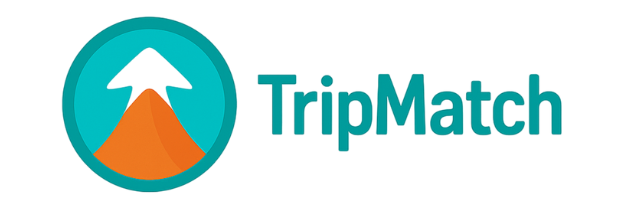
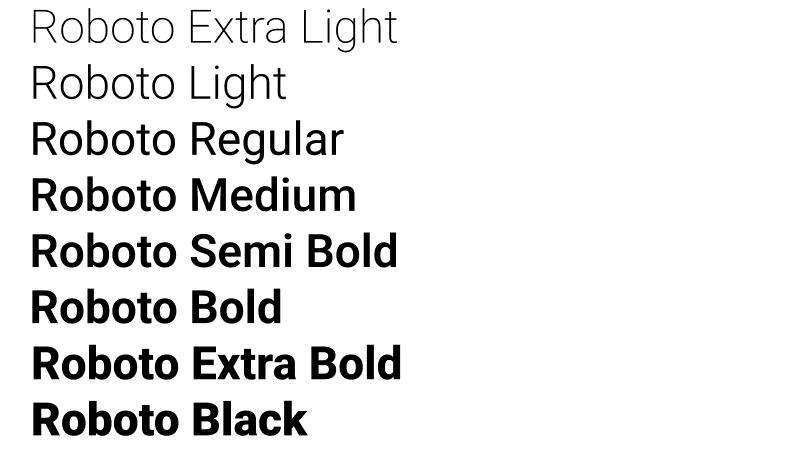

# Capítulo 4: Product Design
## 4.1. Style Guidelines
Las Style Guidelines son un conjunto de normas que definen la redacción, diseño y presentación del contenido del proyecto. El equipo ha creado un repositorio centralizado con recursos visuales compartidos para garantizar coherencia en la aplicación web, móvil y landing page. Estas guías, basadas en principios de diseño, se organizan en tres secciones: General, Web y Mobile.
### 4.1.1. General Style Guidelines
__Branding:__
Para la creación del logo de nuestro producto TripMatch, se ha optado por un diseño representativo y amigable que transmite los valores de aventura, autenticidad y conexión con la naturaleza. El logotipo está compuesto por una tipografía redondeada y moderna, acompañada de un ícono que representa una montaña nevada dentro de un círculo, evocando destinos naturales, seguridad y dirección. Los colores utilizados son armónicos y cálidos, lo que refuerza la idea de un turismo responsable y accesible.

__Typography:__
Para la tipografía de TripMatch, se ha seleccionado una fuente moderna, clara y legible, ideal para dispositivos móviles y plataformas digitales. La tipografía principal es Roboto, una fuente sans-serif amigable y versátil que refuerza el carácter accesible y dinámico de la plataforma. Para títulos y encabezados se puede emplear una versión más gruesa de la misma fuente, garantizando jerarquía visual sin perder coherencia estética.
A continuación, se presentan las tipografías seleccionadas para TripMatch:

Principal: Roboto Regular
Encabezados: Roboto SemiBold / Bold

__Colors:__
La paleta de colores de TripMatch se compone de tonos que evocan calma, naturaleza y aventura. Los colores seleccionados son vibrantes pero equilibrados, lo cual permite captar la atención del usuario sin saturar visualmente la interfaz. A continuación, se presentan los colores seleccionados para TripMatch:

__Spacing:__
El espaciado es un elemento clave en el diseño de TripMatch, ya que permite mantener una interfaz ordenada, limpia y fácil de navegar. Se ha utilizado un espaciado generoso y coherente entre elementos, lo cual mejora la legibilidad y crea una sensación de equilibrio visual. El uso uniforme del espacio contribuye a una experiencia de usuario fluida y cómoda, tanto en dispositivos móviles como en escritorio.

### 4.1.2. Web Style Guidelines
La interfaz web de TripMatch está diseñada con un estilo moderno, limpio y totalmente adaptable a distintos dispositivos, asegurando una navegación fluida tanto en móviles como en pantallas de escritorio. Se emplean paletas de colores inspiradas en la naturaleza y la aventura, tipografías claras como Roboto, y componentes visuales amigables como botones redondeados e íconos intuitivos.

Además, se prioriza la experiencia del usuario mediante interacciones suaves, menús simplificados, tarjetas informativas y animaciones sutiles. Todo el diseño responde a criterios de accesibilidad, garantizando legibilidad, contraste adecuado y compatibilidad con lectores de pantalla.

## 4.2. Information Architecture
### 4.2.1. Organization Systems

### 4.2.2. Labeling Systems
Para garantizar una experiencia intuitiva y sin confusiones, las etiquetas empleadas en TripMatch han sido diseñadas con base en principios de simplicidad, claridad y consistencia.

Etiquetas para la navegación principal (menú inferior):

Inicio: Página principal con acceso a destinos sugeridos y novedades.
Explorar: Sección para descubrir nuevos lugares mediante filtros o búsqueda.
\.Itinerario: Espacio donde el usuario puede planificar, visualizar y editar sus viajes.
\.Amigos: Conexiones sociales y visualización de itinerarios compartidos.
\.Perfil: Acceso a la información personal y configuraciones.

Etiquetas para acciones:
\.Buscar: Entrada para realizar búsquedas de destinos o usuarios.
\.Agregar al itinerario: Acción rápida para incluir un destino en un viaje.
\.Compartir: Opción para enviar itinerarios a amigos.
\.Editar / Eliminar: Gestión de elementos guardados por el usuario.
\.Guardar cambios: Confirmación de edición o creación de itinerario.

Etiquetas asociativas para categorías:
\.Populares, Culturales, Naturaleza, Aventura, Relax: Categorías que agrupan destinos según intereses.
\.Hoy, Próximo destino, Favoritos: Agrupaciones cronológicas y personalizadas que facilitan el acceso a información relevante.

### 4.2.3. SEO Tags and Meta Tags 
### 4.2.4. Searching Systems
### 4.2.5. Navigation Systems
## 4.3. Landing Page UI Design
### 4.3.1. Landing Page Wireframe
### 4.3.2. Landing Page Mock-up
## 4.4. Web Applications UX/UI Design
### 4.4.1. Web Applications Wireframes
### 4.4.2. Web Applications Wireflow Diagrams
### 4.4.2. Web Applications Mock-ups
### 4.4.3. Web Applications User Flow Diagrams
## 4.5. Web Applications Prototyping
## 4.6. Domain-Driven Software Architecture
### 4.6.1. Software Architecture Context Diagram
### 4.6.2. Software Architecture Container Diagrams
### 4.6.3. Software Architecture Components Diagrams
## 4.7. Software Object-Oriented Design
### 4.7.1. Class Diagrams
### 4.7.2. Class Dictionary
## 4.8. Database Design
### 4.8.1. Database Diagram
