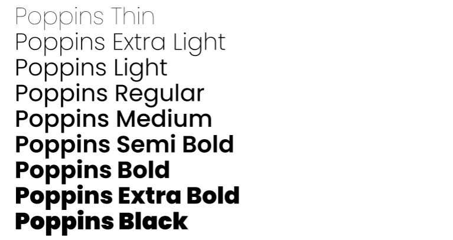
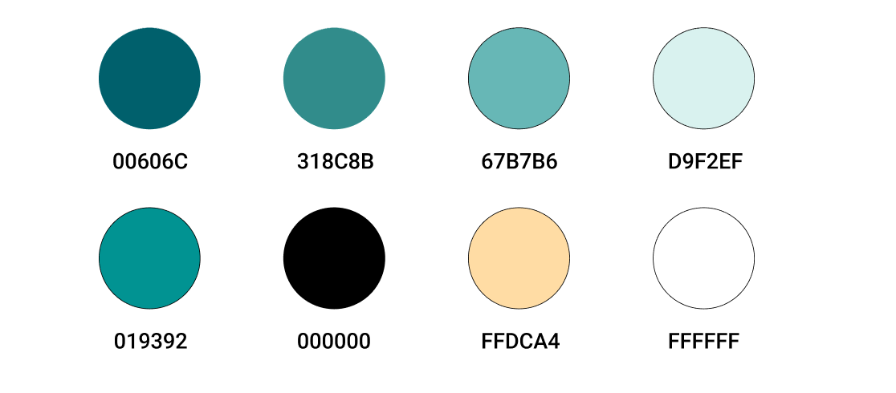
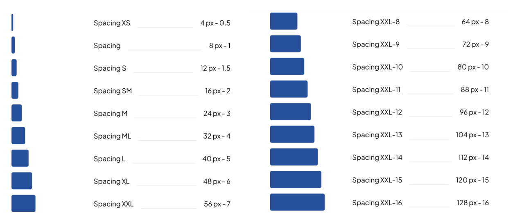
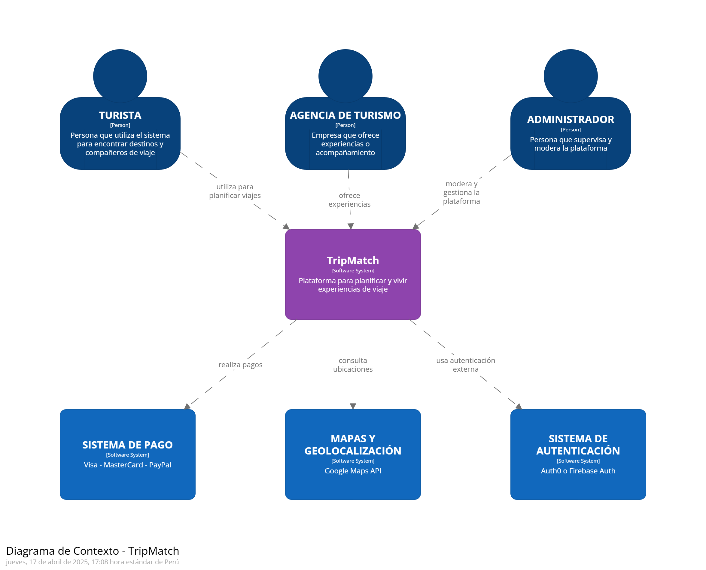
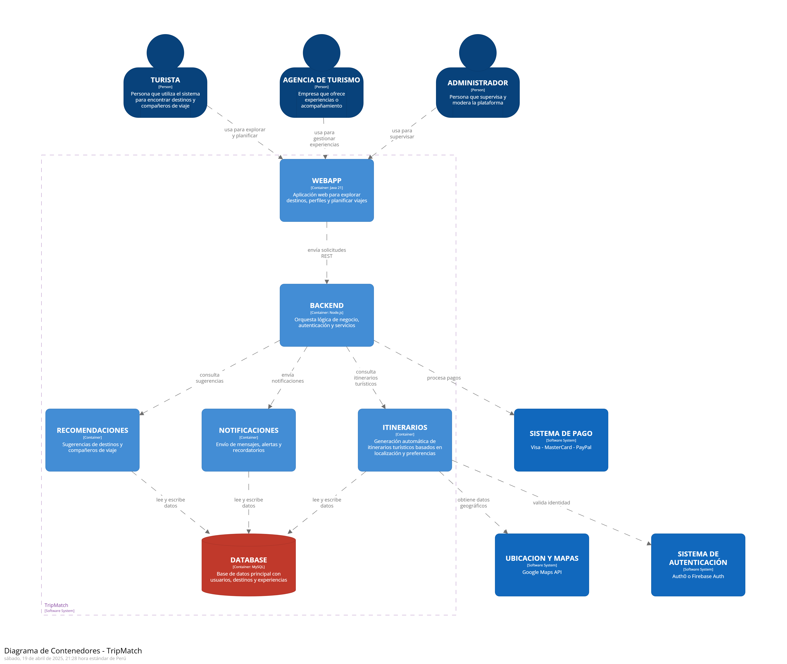
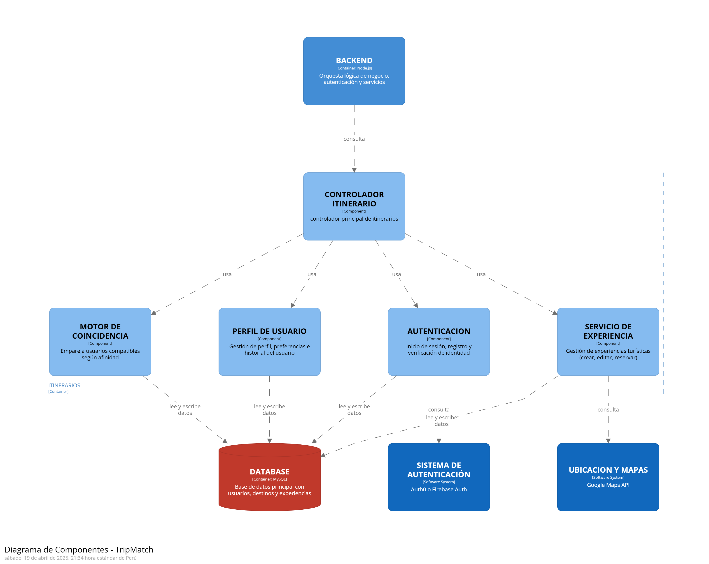

# Capítulo 4: Product Design
## 4.1. Style Guidelines
Una Style Guidelines es un conjunto de lineamientos y criterios que establecen la forma en que deben redactarse, diseñarse o presentar documentos, contenido web, software u otros tipos de trabajos creativos. A continuación, se describen las especificaciones de los parámetros aplicados en la estructura del proyecto.

### 4.1.1. General Style Guidelines
__Branding:__
Para la creación del logo de nuestro producto TripMatch, se ha optado por un diseño representativo y amigable que transmite los valores de aventura, autenticidad y conexión con la naturaleza. El logotipo está compuesto por una tipografía redondeada y moderna, acompañada de un ícono que representa una montaña nevada dentro de un círculo, evocando destinos naturales, seguridad y dirección. Los colores utilizados son armónicos y cálidos, lo que refuerza la idea de un turismo responsable y accesible.

__Typography:__
Para la tipografía de TripMatch, se ha seleccionado una fuente moderna, clara y legible, ideal para dispositivos móviles y plataformas digitales. La tipografía principal es Poppins, una fuente amigable y versátil que refuerza el carácter accesible y dinámico de la plataforma. Para títulos y encabezados se puede emplear una versión más gruesa de la misma fuente, garantizando jerarquía visual sin perder coherencia estética.
A continuación, se presentan la tipografía seleccionadas para TripMatch:

__Colors:__
La paleta de colores de TripMatch se compone de tonos que evocan calma, naturaleza y aventura. Los colores seleccionados son vibrantes pero equilibrados, lo cual permite captar la atención del usuario sin saturar visualmente la interfaz. A continuación, se presentan los colores seleccionados para TripMatch:

__Spacing:__
El espaciado es un elemento clave en el diseño de TripMatch, ya que permite mantener una interfaz ordenada, limpia y fácil de navegar. Se ha utilizado un espaciado generoso y coherente entre elementos, lo cual mejora la legibilidad y crea una sensación de equilibrio visual. El uso uniforme del espacio contribuye a una experiencia de usuario fluida y cómoda, tanto en dispositivos móviles como en escritorio.

### 4.1.2. Web Style Guidelines
La interfaz web de TripMatch está diseñada con un estilo moderno, limpio y totalmente adaptable a distintos dispositivos, asegurando una navegación fluida tanto en móviles como en pantallas de escritorio. Se emplean paletas de colores inspiradas en la naturaleza y la aventura, tipografías claras como Poppins, y componentes visuales amigables como botones redondeados e íconos intuitivos.

Además, se prioriza la experiencia del usuario mediante interacciones suaves, menús simplificados, tarjetas informativas y animaciones sutiles. Todo el diseño responde a criterios de accesibilidad, garantizando legibilidad, contraste adecuado y compatibilidad con lectores de pantalla.

## 4.2. Information Architecture
### 4.2.1. Organization Systems

### 4.2.2. Labeling Systems
Para garantizar una experiencia intuitiva y sin confusiones, las etiquetas empleadas en TripMatch han sido diseñadas con base en principios de simplicidad, claridad y consistencia.

**Etiquetas para la navegación principal (menú inferior):**
* **Inicio:** Página principal con acceso a destinos sugeridos y novedades.
* **Explorar:** Sección para descubrir nuevos lugares mediante filtros o búsqueda.
* **Itinerario:** Espacio donde el usuario puede planificar, visualizar y editar sus viajes.
* **Amigos:** Conexiones sociales y visualización de itinerarios compartidos.
* **Perfil:** Acceso a la información personal y configuraciones.

**Etiquetas para acciones:**
* **Buscar:** Entrada para realizar búsquedas de destinos o usuarios.
* **Agregar al itinerario:** Acción rápida para incluir un destino en un viaje.
* **Compartir:** Opción para enviar itinerarios a amigos.
* **Editar / Eliminar:** Gestión de elementos guardados por el usuario.
* **Guardar cambios:** Confirmación de edición o creación de itinerario.

**Etiquetas asociativas para categorías:**
* **Populares, Culturales, Naturaleza, Aventura, Relax:** Categorías que agrupan destinos según intereses.
* **Hoy, Próximo destino, Favoritos:** Agrupaciones cronológicas y personalizadas que facilitan el acceso a información relevante.

### 4.2.3. SEO Tags and Meta Tags 

### 4.2.4. Searching Systems
Para garantizar una experiencia de usuario fluida y eficiente, se ha definido un sistema de búsqueda que facilite el acceso a la información dentro de TripMatch. 
* **Búsqueda de destinos turísticos:** con filtros por tipo de lugar (playa, ciudad, naturaleza), presupuesto, temporada y popularidad.
* **Búsqueda de experiencias:** por categoría (aventura, cultura, gastronomía), ubicación y duración.
* **Búsqueda por palabras clave:** desde cualquier pantalla, para encontrar rápidamente destinos, usuarios o actividades relacionadas.
* **Historial y búsquedas guardadas:** los usuarios podrán revisar búsquedas recientes y guardar filtros frecuentes para agilizar futuras consultas.

### 4.2.5. Navigation Systems  

## 4.3. Landing Page UI Design
### 4.3.1. Landing Page Wireframe    

La navegación principal está compuesta por secciones clave: Home, About Us, Benefits, How Does It Work?, FAQs, Contact, complementadas por botones visibles de Login y Sign Up, ubicados estratégicamente para facilitar el acceso de los usuarios según su necesidad. La estructura de la landing page fue pensada para acompañar al visitante de forma progresiva, desde entender qué ofrece la aplicación, hasta generar confianza e impulsar la acción de registro.  

**Desktop Web Browser** 
Se presentan las siguientes secciones:  

+ Navbar: Fijo en la parte superior con todas las secciones del sitio y botones a la derecha para iniciar sesión o registrarse.
+ Hero Section: Imagen destacada, con un eslogan directo y botón de llamada a la acción que invita al usuario a unirse.
+ About Us: Breve sección que explica la misión y vision de nuestra aplicación.
+ Benefits: Cards visuales donde se muestran los beneficios clave de la plataforma tanto para agencias como turistas, con íconos y descripciones breves.
+ How Does It Work?: Sección paso a paso explicando el funcionamiento de la plataforma tanto para turistas y agencias.
+ FAQs: Preguntas frecuentes en formato acordeón, de fácil lectura y con foco en resolver dudas comunes.
+ Contact: Formulario básico para consultas o sugerencias, junto con correo electrónico y numero de contacto.
+ Footer: Redes sociales y accesos rápidos adicionales.

**Mobile Web Browser**    
En la versión móvil se incorpora un menú hamburguesa que al desplegarse permite acceder fácilmente a las secciones: Home, About Us, Benefits, How Does It Work?, FAQs, Contact, así como botones de Login y Sign Up.  

Se mantiene una estructura vertical sencilla, optimizada para pantallas pequeñas, priorizando la legibilidad, la navegación por scroll y el toque con el dedo. Las secciones siguen el mismo orden y contenido que en la versión desktop.

### 4.3.2. Landing Page Mock-up  

El mock-up de la landing page presenta un diseño limpio, moderno y enfocado en la experiencia del usuario. Se emplea una estructura clara y jerárquica que guía al visitante desde la propuesta de valor hasta la acción de registro, utilizando una paleta de colores coherente con la identidad visual del proyecto. Se prioriza la legibilidad, el contraste visual y la accesibilidad, adaptando el contenido tanto para pantallas de escritorio como para móviles, asegurando una experiencia fluida y responsiva en cualquier dispositivo.  

## 4.4. Web Applications UX/UI Design
### 4.4.1. Web Applications Wireframes  
La propuesta de wireframes fue desarrollada aplicando los principios de diseño inclusivo, accesibilidad, jerarquía visual y usabilidad. Se busca asegurar una navegación clara y coherente, tanto para turistas como para agencias, adaptando la estructura y contenido de la interfaz según el tipo de usuario para optimizar su experiencia.  

Estructura General  
La interfaz cuenta con una barra de navegación dinámica que varía según el perfil del usuario (turista o agencia). Las secciones están organizadas para facilitar el acceso rápido a las funcionalidades más importantes para cada rol.

**Para turistas**  
Se divide en Inicio, favoritos, itinerarios y una barra de busqueda rapida, donde podra buscar agencias y experiencias por nombre.

**Itinerarios**  

Se muestra el historial de reservas del usuario, permitiéndole ver detalles de sus próximas experiencias y acceder fácilmente a la información necesaria para cada actividad.    

**Resultados de la busqueda**  
Aqui se mostraran los resultados de las busquedas que el usuario realice.   

**visualización de perfil de agencias para Turistas**  

Aquí se muestran los datos públicos de la agencia (nombre, descripcion, contacto, etc.), con opción de editar su información cuando sea necesario.  
 

**Para Agencias de Turismo**  

**Inicio**  

Brinda una vista general del estado actual de la agencia, incluyendo un resumen, comentarios o reseñas recientes de sus experiencias, y algunas reservas recientes.    

  

**Gestión de experiencias**  

Permite a la agencia crear, editar o eliminar experiencias turísticas.  

   

**Reservas**   

En esta sección se listan todas las reservas hechas por los turistas, con información detallada por experiencia y fecha. Incluye filtros para facilitar la gestión.    

  

**Consultas**  

Las agencias pueden ver preguntas o dudas realizadas por los usuarios respecto a sus experiencias y responderlas desde esta misma vista.  

  

**Perfil de agencia**  

Aquí se muestran los datos públicos de la agencia (nombre, descripcion, contacto, etc.), con opción de editar su información cuando sea necesario.  

 

### 4.4.2. Web Applications Wireflow Diagrams
### 4.4.2. Web Applications Mock-ups  

La propuesta de Mock-ups busca representar visualmente la experiencia final de la aplicación web, integrando los principios de diseño inclusivo, jerarquía informativa, accesibilidad y consistencia visual. El diseño responde a las necesidades diferenciadas de turistas y agencias, priorizando la claridad en la navegación, la eficiencia en las tareas y la estética alineada al propósito del proyecto.  
Se utilizó un diseño que incluye una paleta de colores asociada al turismo sostenible, íconos comprensibles, tipografía legible y componentes reutilizables que aseguran coherencia y escalabilidad. 

**Turistas**  
Los mock-ups para turistas presentan una interfaz enfocada en la exploración de experiencias, con una sección de inicio que destaca filtros intuitivos y recomendaciones personalizadas. Las secciones de favoritos e itinerarios permiten un acceso rápido al contenido guardado o reservado. La barra de búsqueda se presenta de forma accesible en todo momento, facilitando la localización de agencias o experiencias específicas.  

**Inicio**  

**Favoritos**

  
**Itinerarios**  

 
 
**Resultados de la busqueda**  

**visualización de perfil de agencias para Turistas**  

 

**Agencias**
En el caso de las agencias, los mock-ups reflejan una interfaz orientada a la gestión eficiente. En el inicio se muestran métricas clave, últimas reservas y reseñas recientes. Las secciones de gestión de experiencias y reservas cuentan con formularios organizados, tablas y botones de acción bien jerarquizados. Se prioriza la claridad en los procesos de edición, respuesta a consultas y mantenimiento del perfil público de la agencia.

Ambas interfaces fueron diseñadas pensando en una experiencia fluida tanto en pantallas de escritorio como en dispositivos con distintas resoluciones, asegurando una estructura responsive y accesible para todos los usuarios.

### 4.4.3. Web Applications User Flow Diagrams
## 4.5. Web Applications Prototyping
## 4.6. Domain-Driven Software Architecture
### 4.6.1. Software Architecture Context Diagram
Este diagrama muestra el sistema TripMatch dentro de su entorno, identificando cómo interactúa con usuarios y otros sistemas externos.

### 4.6.2. Software Architecture Container Diagrams
Este diagrama detalla los principales contenedores (aplicaciones o servicios ejecutables) que componen el sistema y cómo se comunican entre sí.

### 4.6.3. Software Architecture Components Diagrams
Este diagrama profundiza en los componentes internos del contenedor principal

## 4.7. Software Object-Oriented Design
### 4.7.1. Class Diagrams
### 4.7.2. Class Dictionary
## 4.8. Database Design
### 4.8.1. Database Diagram
