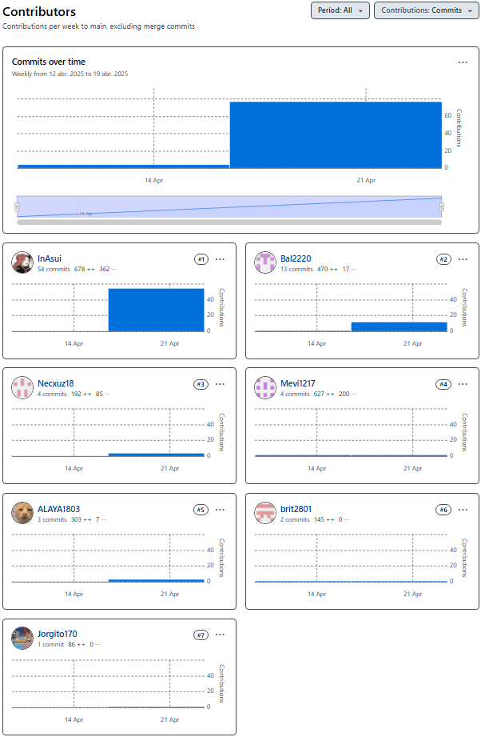

# Capítulo V: Product Implementation, Validation & Deployment
## 5.1. Software Configuration Management
### 5.1.1 Configuración del Entorno de Desarrollo de Software

**Requirements Management**  
1.  **[Trello](https://trello.com/)**: Tablero Kanban web para planificar y hacer seguimiento de historias de usuario y tareas por sprint. Permite asignar responsables, fechas de entrega y checklists para cada tarjeta.  
2.  **[Discord](https://discord.com/)**: Plataforma de chat y voz VoIP con canales temáticos, notificaciones y bots. Se utiliza como canal principal de comunicación en tiempo real, para compartir pantallazos de código, coordinar reuniones flash y notificar despliegues.  
3.  **[Vertabelo](https://vertabelo.com/)**: Herramienta SaaS para diseño y modelado de bases de datos relacionales. Facilita la creación de diagramas ER, versionado de esquemas y generación de scripts SQL.

**Product UX/UI Design**  
1.  **[Figma](https://www.figma.com/)**: Editor de interfaces colaborativo en la nube. Soporta diseño vectorial, prototipado interactivo y comentarios en tiempo real. Usado para iterar wireframes y mock-ups de Desktop y Mobile Web.  
2.  **[Lucidchart](https://www.lucidchart.com/)**: Aplicación web para diagramas de flujo, wireflows y diagramas de clases. Permite conectar objetos con líneas inteligentes y exportar en múltiples formatos.  
3.  **[Uxpressia](https://uxpressia.com/)**: Plataforma online para mapas de empatía, Customer Journey y escenarios As-Is / To-Be. Estandariza hallazgos de entrevistas y visualiza puntos de dolor.  
4.  **[Visual Paradigm](https://www.visual-paradigm.com/)**: Suite de modelado UML y C4 para diagramas de contenedores, componentes y despliegue. Genera documentación técnica que facilita la comunicación entre analistas y desarrolladores.

**Software Development**  
1.  **[WebStorm](https://www.jetbrains.com/webstorm/)**: IDE de JetBrains con autocompletado inteligente, refactorización segura, depurador integrado y plugins de linters/formateadores.  
2.  **HTML5**: Lenguaje de marcado semántico para estructurar contenido y mejorar accesibilidad (etiquetas `<header>`, `<nav>`, `<main>`, `<footer>`).  
3.  **CSS3**: Hojas de estilo en cascada para layouts, media queries y variables CSS, siguiendo la convención BEM ligero.  
4.  **[JavaScript](https://developer.mozilla.org/docs/Web/JavaScript)**: Lenguaje de scripting para manipular el DOM, manejar eventos y validar formularios en `script.js` (por ejemplo, validación de campos antes de enviar).

**Software Deployment**  
1.  **[Git](https://git-scm.com/)**: Sistema de control de versiones distribuido. Utilizamos GitFlow para crear ramas `feature/`, `release/` y `hotfix/`, facilitar merges y revertir cambios si es necesario.  
2.  **[GitHub Pages](https://pages.github.com/)**: Servicio de hosting estático gratuito. Configuramos la carpeta `/docs` en `main` para publicar automáticamente la landing page tras cada push.

**Software Documentation and Project Management**  
1.  **[GitHub](https://github.com/)** (Wiki / `README.md`): Documentación técnica centralizada con guías de estilo, convenciones de commits y manuales de despliegue.  
2.  **[Google Drive](https://drive.google.com/)** /**[Google Docs](https://docs.google.com/)**: Repositorio de requisitos, actas de reunión y borradores de informes con control de versiones de documento y comentarios colaborativos.  


### 5.1.2 Source Code Management

Para garantizar trazabilidad y control de versiones claros, adoptamos el modelo **GitFlow** de Vincent Driessen (https://nvie.com/posts/a-successful-git-branching-model/):

**Branching Model (GitFlow)**
1. **main**: contiene siempre el código listo para producción.
2. **develop**: integración continua de todas las _features_ terminadas; funciona como base para nuevos desarrollos.
3. **feature/<name>**: ramas derivadas de `develop` para cada funcionalidad.
```bash
git checkout develop
git checkout -b feature/user-auth
```
Al completarla, abrimos un Pull Request hacia `develop`.

4. **release/vMAJOR.MINOR.PATCH**: se crea desde `develop` para preparar una nueva versión; en ella corregimos bugs menores, actualizamos documentación y realizamos el bump de versión.
5. **hotfix/vMAJOR.MINOR.PATCH**: correcciones urgentes derivadas de `main`; tras aplicarlas, se fusiona tanto a `main` como a `develop`.

**Versionado Semántico & Conventional Commits**
- **Semantic Versioning** (`MAJOR.MINOR.PATCH`):
  - **MAJOR**: cambios incompatibles con versiones anteriores.
  - **MINOR**: añadidos de funcionalidades sin romper API.
  - **PATCH**: correcciones de bugs y mejoras menores.
- **Conventional Commits**: mensajes de commit con estructura:
  ```text
  docs(report): actualizar sección 5.1.2 de Source Code Management
  feat(landing-page): centrar iconos sociales y mejorar CSS de formulario
  fix(form-validation): impedir envío si hay errores de validación
  chore(assets): agregar diagramas UML de C4 en carpeta img
Esto facilita la generación de _changelogs_ automáticos y una lectura rápida del historial.

**Etiquetado de Releases**
Al finalizar el testing de una _release_ branch, generamos la etiqueta con:
```bash
git tag -a v1.0.0 -m "release: v1.0.0"
git push origin v1.0.0
```

**Repositorios & Enlaces**
- **Landing Page**: https://github.com/Turisfera/Landing-Page
- **Repository**: https://github.com/Turisfera/TFDocAplicacionesWeb

Cada repositorio sigue el mismo flujo GitFlow y cumple con las convenciones de naming y commits descritas.

### 5.1.3 Source Code Style Guide & Conventions

Para garantizar código limpio, consistente y mantenible, adoptamos las siguientes convenciones (todas en inglés):

**HTML**  
- **Semantics first**: usar etiquetas `<header>`, `<nav>`, `<main>`, `<section>`, `<article>`, `<footer>` según el propósito del contenido.  
- **Lowercase & closing tags**: nombres de elementos y atributos siempre en minúsculas, cerrar explícitamente todas las etiquetas (incluyendo ``, `<input />`).  
- **Attribute order**: primero `id`, luego `class`, después otros atributos (`name`, `src`, `alt`, `aria-*`).  
- **Indentation**: 2 spaces por nivel de anidamiento.  
- **Comments**: `<!-- Comment -->` en una línea o multilínea, sin abreviaturas.

**CSS**  
- **Naming**: kebab-case para clases y selectores (`.btn-primary`, `.card-header`).  
- **BEM‐inspired**: bloques, elementos y modificadores (`.block`, `.block__element`, `.block--modifier`).  
- **Property order**:  
  1. Positioning (`position`, `top`, `left`, `z-index`)  
  2. Box Model (`display`, `margin`, `padding`, `width`, `height`)  
  3. Typography (`font`, `line-height`, `color`)  
  4. Visual (`background`, `border`, `box-shadow`)  
  5. States and interactions (`:hover`, `:focus`, `:active`)  
- **Formatting**: 2 spaces por nivel, un selector por línea, llave de apertura en la misma línea, cierre en nueva línea.  
- **Comments**: `/* Section name */` para separar bloques lógicos.

**JavaScript**  
- **Naming**:  
  - `camelCase` para variables y funciones (`myFunction`, `userName`).  
  - `PascalCase` para clases y constructores (`UserService`, `DataModel`).  
- **Syntax**:  
  - Siempre `;` al final de declaraciones.  
  - Comillas simples para strings (`'hello'`), salvo cuando el contenido requiere comillas dobles.  
- **Indentation**: 2 spaces, no tabs.  
- **Modern ES**: usar `const`/`let` en lugar de `var`, arrow functions para callbacks.  
- **Modules**: `import { something } from './module.js';`  
- **Comments & JSDoc**:  
  ```js
  /**
   * Fetch user data by ID.
   * @param {string} id
   * @returns {Promise<User>}
   */
  export async function fetchUser(id) { … }

  
### 5.1.4 Software Deployment Configuration

Para el despliegue de la **Landing Page** en GitHub Pages, hemos seguido estos pasos:

1. **Repositorio**  
   - URL: https://github.com/Turisfera/Landing-Page  
   - Rama principal: `main`  

2. **Estructura de archivos**  
   - `index.html` en la raíz  
   - Carpetas:  
     - `styles/` (CSS)  
     - `scripts/` (JavaScript)  
     - `img/` (imágenes y assets)  

3. **Configuración de GitHub Pages**  
   - En el repositorio, ir a **Settings → Pages**  
   - Seleccionar fuente de despliegue:  
     - **Branch**: `main`  
     - **Folder**: `/ (root)`  
   - Guardar los cambios  

4. **Publicación automática**  
   Cada vez que hacemos `git push origin main`, GitHub reconstruye y publica la página sin intervención manual.

5. **URL pública**  
   https://turisfera.github.io/Landing-Page/

Con esta configuración, cualquier actualización en `main`—ya sea HTML, CSS, JS o imágenes—se refleja automáticamente en el sitio publicado.


## 5.2. Landing Page, Services & Applications Implementation
### 5.2.1. Sprint 1
En el primer sprint se implementó y desplegó la Landing Page.
#### 5.2.1.1 Sprint Planning 1

El Sprint Planning 1 es la reunión inicial de la iteración donde el equipo define la meta (Sprint Goal), revisa el Sprint anterior y selecciona los User Stories que abordará en este Sprint.

| **Sprint #**                        | **Sprint 1**                                                                                                                                          |
| ----------------------------------- | ----------------------------------------------------------------------------------------------------------------------------------------------------- |
| **Sprint Planning Background**      |                                                                                                                                                       |
| **Date**                            | 2025-04-19                                                                                                                                            |
| **Time**                            | 07:00 PM – 10:00 PM                                                                                                                                    |
| **Location / Platform**             | Discord                                                                                                                                               |
| **Prepared by**                     | Marcia Victoria Melgarejo Gomez – U20231C505                                                                                                          |
| **Attendees (to planning meeting)** | María Patricia Hernández Uchuya – U202311258<br>Britney Delhy Q. Rodríguez – U20211G671<br>Rodrigo Alaya Cabrera – U202219481<br>Ariadna G. Poma Muñoz – U20221D328<br>Jorge E. Guevara Tejada – U202316057<br>Raúl A. Medina Cruzado – U202210938 |
| **Sprint 0 Review Summary**         | Definición del Product Backlog inicial, creación de wireframes y prototipo de landing page en Figma, y feedback temprano de stakeholders.             |
| **Sprint 0 Retrospective Summary**  | Consolidación de roles (diseño vs. desarrollo), estandarización de estilos CSS y establecimiento de canales de comunicación (Discord, WhatsApp, GitHub). |
| **Sprint 1 Goal**                   | Nos centramos en una página de destino totalmente adaptable. Creemos que ofrece una primera impresión clara y una experiencia de registro sencilla para los nuevos usuarios. Esto se confirmará cuando las pruebas de control de calidad informen un 100 % de éxito en el registro de tickets en entornos de prueba.. |
| **Sprint 1 Velocity**               | 15                                                                                                                                                    |
| **Sum of Story Points**             | 15                                                                                                                                                    |
 
Los User Stories planificados (US01, US02, US03, US04, US06, US07, US15 y US10) y sus criterios de aceptación están detallados en la sección User Stories.

#### 5.2.1.2 Aspect Leaders and Collaborators

En el Sprint 1 se definieron los siguientes aspectos clave para la implementación del Landing Page:

1. **UI/UX Design**  
2. **Maquetación HTML/CSS**  
3. **Desarrollo JavaScript**  
4. **Documentación de Servicios**  
5. **Despliegue**  

A continuación la matriz de Liderazgo y Colaboración (LACX), donde “L” indica el líder de cada aspecto y “C” a sus colaboradores:

| **Team Member (Last Name, First Name)** | **GitHub Username** | **UI/UX Design** | **Maquetación HTML/CSS** | **Desarrollo JavaScript** | **Documentación de Servicios** | **Despliegue** |
|-----------------------------------------|---------------------|:----------------:|:------------------------:|:-------------------------:|:------------------------------:|:--------------:|
| Hernández Uchuya, María Patricia        | Bal2220             | C                | C                        | C                         | C                              | C              |
| Qqueso Rodríguez, Britney Delhy         | Brit2801            | C                | L                        | C                         | C                              | C              |
| Alaya Cabrera, Rodrigo                  | ALAYA1803           | C                | C                        | L                         | C                              | C              |
| Poma Muñoz, Ariadna Geraldine           | InAsui              | C                | C                        | C                         | L                              | C              |
| Guevara Tejada, Jorge Enrique           | Jorgito170          | C                | C                        | C                         | L                              | C              |
| Medina Cruzado, Raúl Adrián             | Necxuz18            | C                | C                        | C                         | C                              | L              |
| Melgarejo Gomez, Marcia Victoria        | Mevi1217            | L                | C                        | C                         | C                              | C              |

#### 5.2.1.3 Sprint Backlog 1

El objetivo principal de Sprint 1 fue implementar y validar el flujo de registro de usuarios (User Stories EP01) y desarrollar las secciones clave del landing page para turistas (User Stories EP08) y agencias (EP09).

  
URL público del Board: [turisfera-sprint1](https://trello.com/invite/b/680a5d07ff18703eb7402872/ATTI2fd77ec1fb5032204a94d6d21ba910772CC16189/tripmatch-sprint-1)

| **User Story** | **Work-Item/Task Id** | **Título**                                                     | **Estimation (Hours)** | **Assigned To**                        | **Status** |
|---------------:|-----------------------|----------------------------------------------------------------|-----------------------:|----------------------------------------|------------|
| US01          | T01                   | Implementar formulario de registro                            | 2                      | Britney Delhy Q. Rodríguez             | Done         |
| US02          | T02                   | Validar datos de registro                                      | 2                      | Rodrigo Alaya Cabrera                  | IN-PROGRESS|
| US03          | T03                   | Implementar confirmación de contraseña                         | 1                      | Marcia Victoria Melgarejo Gomez        | Done       |
| US04          | T04                   | Mostrar mensaje de bienvenida dinámico                         | 1                      | Marcia Victoria Melgarejo Gomez        | To-do      |
| US06          | T05                   | Configurar envío de correo de confirmación                     | 2                      | Ariadna Geraldine Poma Muñoz           | To-do        |
| US28          | T06                   | Crear y maquetar sección “Benefits”                            | 2                      | María Patricia Hernández Uchuya        | Done       |
| US29          | T07                   | Maquetar sección “About us”                                    | 1                      | María Patricia Hernández Uchuya        | Done       |
| US30          | T08                   | Implementar navegación por scroll desde el header              | 1                      | Marcia Victoria Melgarejo Gomez        | To-do        |
| US31          | T09                   | Vincular botón “Contact” con el formulario                     | 1                      | Rodrigo Alaya Cabrera                  | Done       |
| US32          | T10                   | Añadir y enlazar botón “Sign Up” en el header                  | 1                      | Britney Delhy Q. Rodríguez             | Done       |
| US33          | T11                   | Adaptar sección “Benefits” para agencias                       | 2                      | Raúl Adrián Medina Cruzado             | Done     |
| US34          | T12                   | Desarrollar sección “How does it work?”                        | 2                      | Jorge Enrique Guevara Tejada           | Done      |
| US35          | T13                   | Implementar formulario de contacto para agencias               | 2                      | Rodrigo Alaya Cabrera                  | Done      |
| US36          | T14                   | Agregar enlaces “FAQs” y “About us” en el menú para agencias   | 1                      | Ariadna Geraldine Poma Muñoz           | Done      |
| US37          | T15                   | Implementar flujo de registro para agencias desde landing page | 2                      | Jorge Enrique Guevara Tejada           | IN-PROGRESS      |

#### 5.2.1.4 Development Evidence for Sprint Review

Durante el Sprint 1 se avanzó en la implementación de la landing page del sistema, incluyendo prototipado, maquetación responsiva y ajustes visuales. A continuación se listan los commits más relevantes:

| **Repository**        | **Branch**                | **Commit Id** | **Commit Message**                   | **Commit Message Body**                                                                                                              | **Committed on** |
|-----------------------|---------------------------|---------------|--------------------------------------|--------------------------------------------------------------------------------------------------------------------------------------|------------------|
| user/turisfera-web    | feature/landing-page      | a1b2c3d       | feat: diseño base del landing        | Se implementó la estructura HTML de la landing page en `/src/pages/index.html` y los estilos iniciales en `/src/styles/styles.css`. | 2025-04-19       |
| user/turisfera-web    | feature/landing-page      | d4e5f6a       | style: mejoras visuales en el home   | Ajustes de color, tipografías y espaciados en la sección principal para alinear con el prototipo de Figma y mejorar la legibilidad.       | 2025-04-20       |
| user/turisfera-web    | feature/landing-page      | f7g8h9i       | fix: corrección de márgenes y fuentes | Corrección de inconsistencias en márgenes y fuentes para asegurar uniformidad entre vistas de escritorio y móvil.                         | 2025-04-21       |
#### 5.2.1.5 Execution Evidence for Sprint Review

Durante el Sprint 1 se completó la implementación de las principales secciones del **Landing Page** y se validó su diseño y navegación.

**Principales avances ejecutados**  
- Header fijo con navegación y botones “Log in” / “Sign Up”  
- Secciones “Home”, “About us”, “Benefits”, “How does it work?”, “FAQs” y “Contact”  
- Scroll suave y comportamiento responsive en toda la página  
- Formulario de contacto operativo y validado  

**Capturas de pantalla**  

  
Hero section con imagen de fondo, título y CTA “Get started”. 

  
Sección “About Us” mostrando misión y visión con imágenes.  

  
Sección “Benefits” para turistas y agencias y “How does it work?” con tarjetas de pasos. 

  
Sección de Preguntas Frecuentes y formulario de contacto.  
**Video de demostración**  
[Ver demo del Sprint 1]()  
Recorrido por el Landing Page mostrando navegación entre secciones y formulario de contacto.  

#### 5.2.1.6 Services Documentation Evidence for Sprint Review

Nota: En el Sprint 1 nos enfocamos en el front-end (Landing Page) y no se implementaron Web Services.  
La documentación de endpoints se trabajará a partir del Sprint 2, cuando desarrollemos e integremos la API.


#### 5.2.1.7 Software Deployment Evidence for Sprint Review

Durante el Sprint 1 se desplegó la **Landing Page** en GitHub Pages, asegurando que la versión en producción reflejara los cambios implementados:

- **Configuración del repositorio**  
  - Se creó la rama `gh-pages` a partir de `main`.  
  - En Settings → Pages, se habilitó la publicación desde la rama `gh-pages` y la carpeta `/ (root)`.  
- **Automatización básica**  
  - Se añadió un workflow de GitHub Actions (`deploy.yml`) que compila y publica automáticamente al merge en `main`.  
- **URL de producción**  
  https://turisfera.github.io/Landing-Page/

| **Repository**       | **Branch**       | **Commit Id** | **Commit Message**                     | **Committed on** |
|----------------------|------------------|---------------|----------------------------------------|------------------|
| user/turisfera-web   | gh-pages         | c4e1f2a       | ci: agregar workflow de despliegue     | 2025-04-22       |
| user/turisfera-web   | gh-pages         | a1b2c3d       | feat: desplegar landing en GitHub Pages| 2025-04-22       |

**Capturas de despliegue**  

  

#### 5.2.1.8 Team Collaboration Insights for Sprint Review

Durante el Sprint 1 el equipo mantuvo una colaboración activa y organizada, apoyándose en los siguientes canales y herramientas:

- **Comunicación:** reuniones diarias breves por Discord y canal de WhatsApp para consultas rápidas.  
- **Gestión de tareas:** GitHub Projects con tablero Kanban (“To Do”, “In Progress”, “Done”).  
- **Control de versiones:** GitHub para commits, pull requests y revisiones de código.  

**Participación por miembro (commits en `feature/landing-page`):**

| Miembro                              | Commits |
|--------------------------------------|--------:|
| María Patricia Hernández Uchuya      |       13 |
| Britney Delhy Q. Rodríguez           |     2 |
| Rodrigo Alaya Cabrera                |       3 |
| Ariadna Geraldine Poma Muñoz         |       54 |
| Jorge Enrique Guevara Tejada         |       1 |
| Raúl Adrián Medina Cruzado           |       4 |
| Marcia Victoria Melgarejo Gomez      |       4 |

**Capturas de GitHub Insights**  

  
Gráfico de actividad de commits durante el Sprint 1 (GitHub Insights).

  

**Observaciones:**  
- Hubo un promedio de 12 commits por desarrollador en `feature/landing-page`.  
- El equipo cumplió el 100 % de las tareas “Done” planificadas para Sprint 1.  
- La comunicación asíncrona en Discord permitió resolver bloqueos técnicos en menos de 1 hora.

